---
author:
- François Rioult
lang: fr
title: Application des LLM
subtitle: Fonctionnement d'un modèle de langue
---

# Architecture

Les LLM fonctionnent grâce à des réseaux de neurones récurrents, qui ont *appris* à prédire le prochain jeton selon les jetons qu'il a lus précédemment. 

C'est le même fonctionnement que votre application de rédaction de MMS qui vous propose des mots probables selon les mots précédents dans votre message en cours d'écriture. 

<!---------------------------------------------------------------->
## Apprentissage par réseau récurrent de neurones

Un réseau de neurones est une structure informatique qui apprend à mettre en relation une *entrée* et une *sortie*. On fournit au réseau des paires $(entree, sortie)$ pour lesquelles il doit déterminer une relation *fonctionnelle*.

Entrée comme sortie peuvent être quasiment n'importe quel type de donnée : numérique, texte, image, vidéo, etc. Tout finira par être transformé en vecteurs de nombre, par une opération d'*embedding* (intégration en français).

### Neurone 

Un *neurone* est un objet informatique, qui possède :

* une valeur (généralement entre -1 et 1)
* des connexions *entrantes* pondérées avec d'autres neurones : un ensemble de poids $w_i$ tels que $h_i = \sum_j w_j h_j$
* des connexions *sortantes* avec d'autres neurones

Un neurone reçoit des informations, à sa manière, et transmet une information.

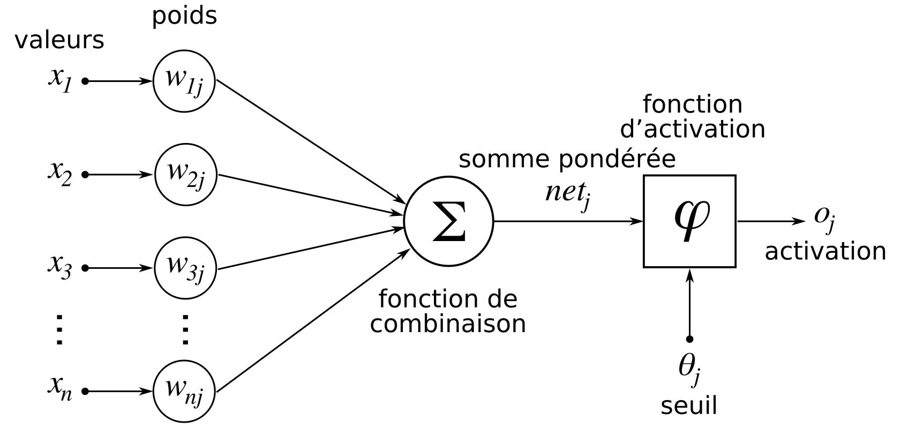

### Réseau de neurones

Un réseau de neurones structure la transformation\ :

* de l'entrée : multi-dimensionnelle, donne initie le réseau par autant de neurones que de dimensions
* en la sortie (multi-dimensionnelle, autant de neurones que de dimension) 
* en intercalant des couches de neurones

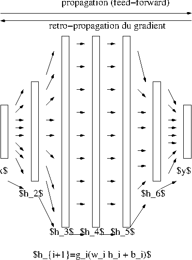 

### Redescription de l'espace

Il faut voir une couche de neurones comme étant une *projection* de son entrée vers un espace de redescription où la *similarité* entre les objets étudiés sera plus *discriminante* que celle de l'espace initial.

La notion de discrimination est définie ici par le contexte d'appariement fourni au cours de l'apprentissage. 

### Entraînement d'un réseau de neurones

La tâche d'entraînement d'un réseau de neurones, appelée *apprentissage*, consiste sur un réseau *vierge* à présenter un exemple d'entrée et de mesurer la sortie obtenue. Cette sortie est comparée à la *sortie attendue* ou *vérité*, selon une mesure de *perte* définie, qui sert d'indication au réseau pour être modifié.

La modification des poids du réseau procède par *rétro-propagation de gradient*. Le *gradient* est le mot physique pour *variation*. De la sortie à l'entrée, on propage la variation entre la sortie obtenue et la vérité - dans la pratique, on fait des groupes d'instances (*batch*) et on rétro-propage la moyenne.

### Réseau de neurones récurrent

Lorsque les données sont de nature *séquentielle*, c'est-à-dire concerne une évolution temporelle ou spatiale, il faut un réseau capable de traiter des entrées séquentielles\ : un réseau de neurones récurrent. Les applications sont nombreuses : texte, vidéo, audio, trajectoires.

Un réseau récurrent est constitué de *cellules* égrénant le temps, reliées aux autres cellules par des mécanismes d'*attention*. La largeur de la fenêtre d'attention définit la taille du *contexte*.

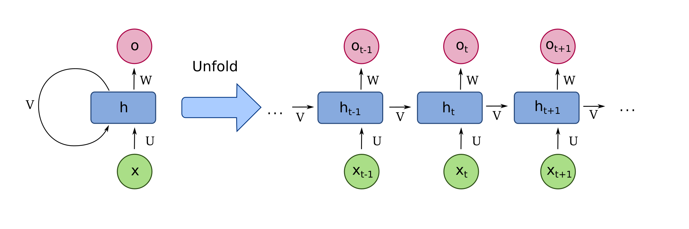


<!---------------------------------------------------------------->
## Mécanisme de l'attention


<!---------------------------------------------------------------->
## Transformers

## Mécanisme de l’attention

### Préambule

Le lecteur peu familier des mathématiques pourra se poser de nombreuses questions sur le pourquoi et le quoi de toutes ces équations. D'où viennent-elles ? L'informaticien habitué à la simulation se convaincra que les fonctions utilisées ci-dessous permettent de formaliser simplement le problème en laissant les aspects calculatoires à un algorithme général d'optimisation qui calculera l'appariement en l'entrée et la sortie, en approximant les fonctions implémentées.

Il s'agit ici d'une construction intellectuelle particulière : la réussite de l'apprentissage dépend de l'optimisation d'un formalisme imposé. Elle peut dérouter les personnes confortables avec l'idée qu'une machine déroule un programme conçu par l'humain. Pour l'apprentissage, elle optimise plutôt la formalisation réalisée par l'humain.

Lorsqu'on utilise cet axe de lecture et fait abstraction de la difficulté mathématique de l'optimisation, les éléments ci-dessous sont plus abordables.

Les concepteurs de ces systèmes ne manquent en tout cas pas d'imagination pour développer leurs structures, en valorisant des techniques primitives mais puissantes : transformation linéaires, non-linéaires, activation, qui ont prouvé leur expressivité. Quand on ne sait pas comment combiner plusieurs informations, en général on fait la somme avec des poids, ça et les transformations de potentiel en probabilité, c'est un peu la base.

### Seq2Seq sans attention

Historiquement, l’alignement de séquences d’items requiert l’insertion d’un encodeur/décodeur de *contexte*.

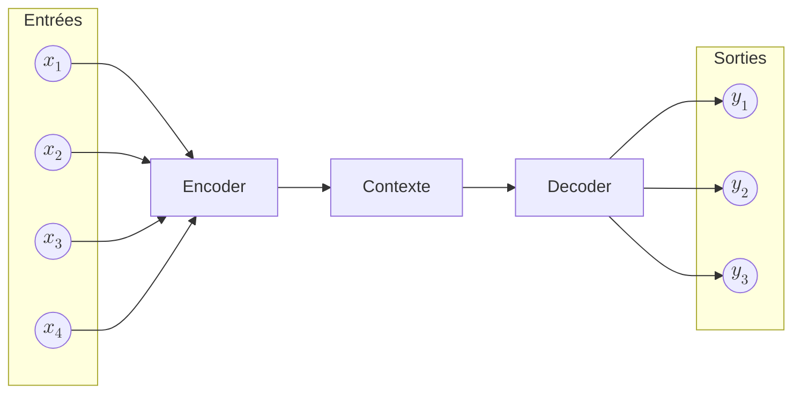

On considère une *séquence d’entrée* :

$$
(x_1, x_2, x_3, \dots, x_T)
$$

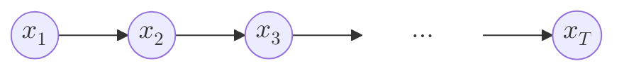

On définit également une *séquence de sortie* (*a priori* de longueur différente) :

$$
(y_1, y_2, y_3, \dots, y_{T'})
$$

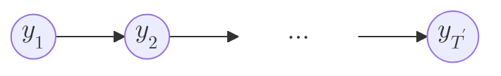

#### 1. Encodeur : construction du contexte global

L’encodeur traite la séquence d’entrée pas à pas :

$$
h_t = f_{\mathrm{enc}}(x_t, h_{t-1}), \quad t = 1, \dots, T
$$

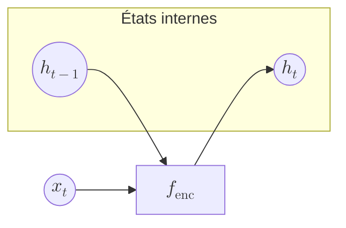

Le *contexte global unique* est alors défini comme :

$$
c = h_T
$$

Toute l’information de la séquence d’entrée est *compressée* dans ce vecteur.

---

#### 2. Décodeur : génération conditionnée par le contexte

Le décodeur est initialisé par le contexte :

$$
s_0 = c
$$

Puis, à chaque pas de temps, il génère un état interne :

$$
s_t = f_{\mathrm{dec}}(y_{t-1}, s_{t-1}), \quad t = 1, \dots, T'
$$

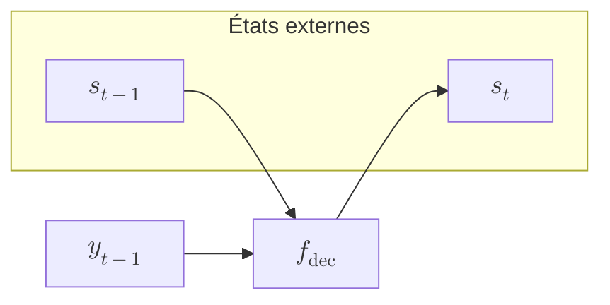

`softmax` qui transforme un *potentiel* $W_o s_t$ en probabilité du token de sortie est donné par :

$$
P\!\left(y_t \mid y_{<t}, x_1, \dots, x_T\right) = \mathrm{softmax}(W_o s_t)
$$

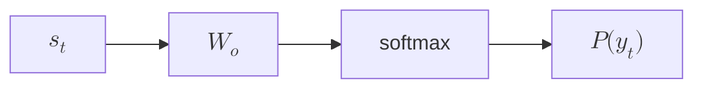

#### 3. Résumé fonctionnel

Le résumé fonctionnel du mécanisme est :

$$
\boxed{
\begin{aligned}
c &= \mathrm{Encoder}(x_1, \dots, x_T) \\
y_t &= \mathrm{Decoder}(y_{<t}, c)
\end{aligned}
}
$$

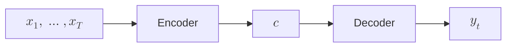

---

### Transition vers l’attention

Dans un modèle avec attention, le contexte devient *dépendant de t* :

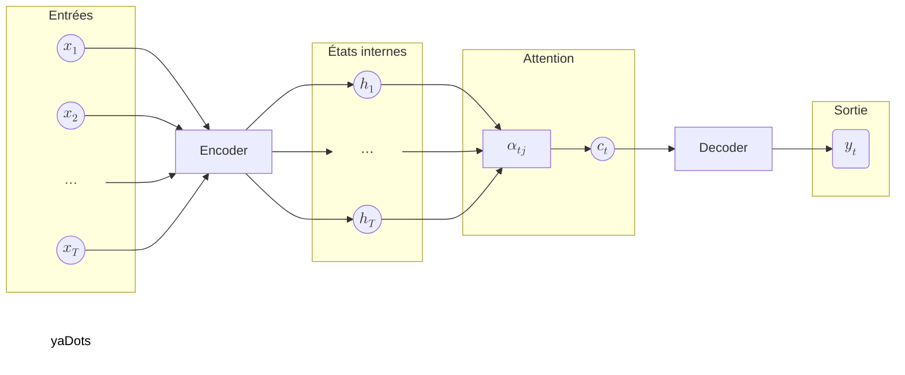

Cette dépendance temporelle se formalise par :

$$
c \longrightarrow c_t = \sum_j \alpha_{tj} h_j
$$

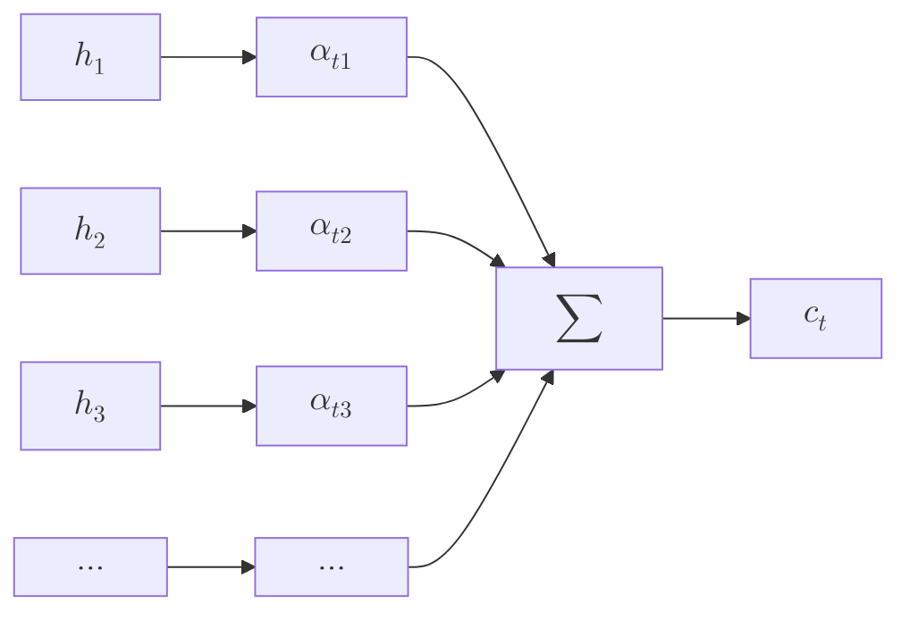

Chaque sortie reconstruit ainsi son propre contexte.

### Pondération locale du contexte

Le mécanisme d’attention remplace un *résumé global unique* par un *mécanisme de pondération locale*.

Formellement, pour chaque entrée $x_i$, la sortie associée est :

$$
y_i = \sum_j w_{ij} x_j
$$

```mermaid
flowchart LR
    xj["$$x_j$$"] -->|$$w_{ij}$$| sum["$$\sum$$"]
    sum --> yi["$$y_i$$"]
```

---

### Décomposition : query, key, value

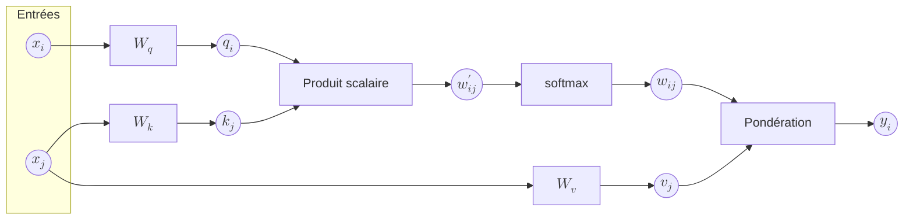

Les trois *rôles fonctionnels* assignés à une même entrée $x$ sont matérialisés par des projections linéaires distinctes. Elles confèrent à chaque position la capacité de chercher, d’évaluer et de synthétiser l’information pertinente dans la séquence.

### 1. Query — le signal de recherche

La *requête* de la position $i$ encode ce que cette position cherche dans le reste de la séquence :

$$
q_i = W_q x_i
$$

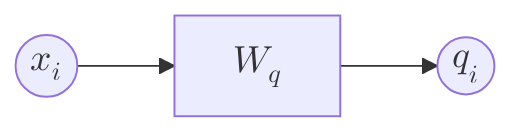

### 2. Key — le critère de pertinence

La *clé* associée à la position $j$ décrit ce que cette position peut offrir à une requête :

$$
k_j = W_k x_j
$$

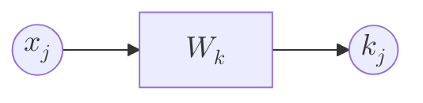

### 3. Similarité query–key

Le score de pertinence entre la requête $q_i$ et la clé $k_j$ est obtenu par produit scalaire :

$$
w'_{ij} = q_i^\top k_j
$$

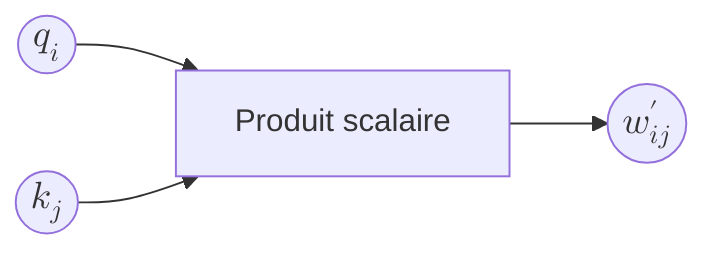

### 4. Normalisation des poids

Les scores sont transformés en *poids d’attention* via une normalisation softmax :

$$
w_{ij} = \frac{\exp(w'_{ij})}{\sum_m \exp(w'_{im})}
$$

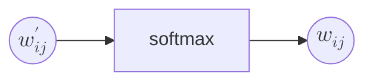

### 5. Value — le contenu combiné

La *valeur* associée à la position $j$ contient l’information effectivement agrégée :

$$
v_j = W_v x_j
$$

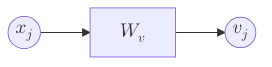

### 6. Agrégation pondérée

La sortie contextuelle $y_i$ est une combinaison des valeurs pondérées par les poids d’attention :

$$
y_i = \sum_j w_{ij} v_j
$$

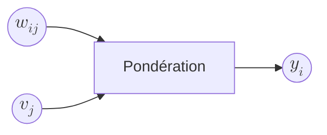

### Résumé fonctionnel

La synthèse opérationnelle de la décomposition $q$–$k$–$v$ est :

$$
\boxed{
\begin{aligned}
q_i &= W_q x_i \\
k_j &= W_k x_j \\
w_{ij} &= \mathrm{softmax}(q_i^\top k_j)_j \\
y_i &= \sum_j w_{ij} \, W_v x_j
\end{aligned}
}
$$

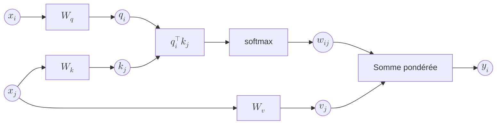

---

### À retenir

L’attention permet à chaque token de *définir un critère de similarité*, d’évaluer toutes les autres positions selon ce critère, puis de *combiner les informations pertinentes* pour construire une représentation contextuelle adaptée à la décision.

Aspect important dans les transformers : [connexion residuelle](https://arxiv.org/abs/1512.03385)
<!---------------------------------------------------------------->
## Définition d'un LLM


Un LLM (ou *large language model*) est un modèle de langue constitué par un réseau de neurones récurrent entraîné à prédire des tokens de texte à partir d'un contexte de tokens, sur des *corpus* de textes proportionnels à sa *taille*.

La façon de *tokenizer* le texte est importante. Cette fonctionnalité peut elle-même être fournie par un LLM.

<!---------------------------------------------------------------->
# Constituants informatiques

## Dataset

Il s'agit du corpus de textes qui a servi à entraîner le RNN. Ce peut être du texte brut, des pages web, des appariements question-réponse (*question/answer* Q/A en anglais).

Les dataset peuvent également être spécialisés dans des domaines, par exemple la médecine, de code, la recherche...

## Modèle

Le modèle, c'est-à-dire le RNN, est précisé par sa *structure* sous forme de tenseurs et ses *poids*. Il est généralement conçu pour être exécuté sur une carte graphique, programmée dans le langage CUDA. Des librairies de plus haut niveau (Tensorflow, Torch, Keras) sont disponibles en python.

* [vade mecum sur la conception d'un llm](https://symbl.ai/developers/blog/a-guide-to-building-an-llm-from-scratch/)
* [GPT from scratch - code - architecture détaillée](https://jaketae.github.io/study/gpt/)

## Évaluation - benchmark

Un LLM peut être confronté à des benchmarks, qui sont des paires Q/A.

* [test sans contamination des meilleurs modèles](https://livebench.ai/#/)

<!---------------------------------------------------------------->
# Constituants opérationnels

## API

Une part importante de l'écosystème consiste en la fourniture de ressources de calcul pour faire tourner les LLM. On dispose d'*endpoint* (point d'accès) interrogeables par une API.

## Chat template

Un chat alterne des tours de parole entre les différents *rôles* : `user`, `assistant`, `system`. C'est un échange de messages, qui démarrent par le token `<|im_start|>`, introduisent le rôle de l'émetteur puis le *contenu* du message, et terminent par le token `<|im_end|>`.

Le chat est paramétré par le *chat template*, qui indique au modèle comment il doit se comporter. C'est quasiment du code, en tout cas un langage proche de [`twig`](https://twig.symfony.com/). Par exemple, le template pour `HuggingFaceTB/SmolLM2-360M-Instruct` (cf. clé `chat_template` dans `tokenizer_config.json`) :

```twig

  
    {{ '<|im_start|>system\nYou are a helpful AI assistant named SmolLM, trained by Hugging Face<|im_end|>\n' }}
  
  {{'<|im_start|>' + message['role'] + '\n' + message['content'] + '<|im_end|>' + '\n'}}


  {{ '<|im_start|>assistant\n' }}

```

* [chat template](https://huggingface.co/docs/transformers/main/en/chat_templating)


## Comment le modèle s'arrête-til de produire des jetons ?

Le modèle a été entraîné sur des textes terminant par le token EOS `<|endoftext|>`.

* [Comment le LLM sait quand s'arrêter de générer](https://www.louisbouchard.ai/how-llms-know-when-to-stop/)
* [Discussion sur ce qui le fait s'arrêter](https://www.reddit.com/r/LocalLLaMA/comments/1haizeq/llm_noob_here_can_any_explain_whats_happening/)

## System prompt

* [Obtenir le system prompt d'un LLM](https://www.reddit.com/r/ChatGPTPromptGenius/comments/1h2uxeh/full_starting_prompt_for_chatgpt/)
* [systeme prompt de chatgpt](https://www.reddit.com/r/ChatGPT/comments/1h94hz8/accidentally_discovered_a_prompt_which_gave_me/)
* [meta promt d'openai](https://platform.openai.com/docs/guides/prompt-generation)
* <https://www.reddit.com/r/ChatGPTCoding/comments/1hkudnz/openai_reveals_its_prompt_engineering/>

### Transformer

* [Illustration animée de l'ensemble des étapes](https://bbycroft.net/llm)
* [Transformers par 3Blue1Brown](https://www.youtube.com/watch?v=wjZofJX0v4M)
* [Attention par 3Blue1Brown](https://www.youtube.com/watch?v=eMlx5fFNoYc&list=PLZHQObOWTQDNU6R1_67000Dx_ZCJB-3pi&index=8)
* [transformer explained](https://poloclub.github.io/transformer-explainer/)
* [Transformer illustré](http://jalammar.github.io/illustrated-transformer/)
* [Transformers + architecture + code](https://jaketae.github.io/study/transformer/)
* [Spécifique attention](https://jaketae.github.io/study/seq2seq-attention/)
* [Les explications les plus précises](<https://www.youtube.com/watch?v=kCc8FmEb1nY>)
* [Framework mathématique - Anthropic - animation de l'attention sur texte](https://transformer-circuits.pub/2021/framework/index.html)
