## Mécanisme de l’attention

### Préambule

Le lecteur peu familier des mathématiques pourra se poser de nombreuses questions sur le pourquoi et le quoi de toutes ces équations. D'où viennent-elles ? L'informaticien habitué à la simulation se convaincra que les fonctions utilisées ci-dessous permettent de formaliser simplement le problème en laissant les aspects calculatoires à un algorithme général d'optimisation qui calculera l'appariement en l'entrée et la sortie, en approximant les fonctions implémentées.

Il s'agit ici d'une construction intellectuelle particulière : la réussite de l'apprentissage dépend de l'optimisation d'un formalisme imposé. Elle peut dérouter les personnes confortables avec l'idée qu'une machine déroule un programme conçu par l'humain. De fait, elle optimise plutôt la formalisation réalisée par l'humain.

Lorsqu'on utilise cet axe de lecture et fait abstraction de la difficulté mathématique de l'optimisation, les éléments ci-dessous sont plus abordables.

Les concepteurs de ces systèmes ne manquent en tout cas pas d'imagination pour développer leurs structures, en valorisant des techniques primitives mais puissantes : transformation linéaires, non-linéaires, activation, qui ont prouvé leur expressivité. Quand on ne sait pas comment combiner plusieurs informations, en général on fait la somme avec des poids, ça et les transformations de potentiel en probabilité, c'est un peu la base.

### Seq2Seq sans attention

Historiquement, l’alignement de séquences d’items requiert l’insertion d’un encodeur/décodeur de *contexte*.

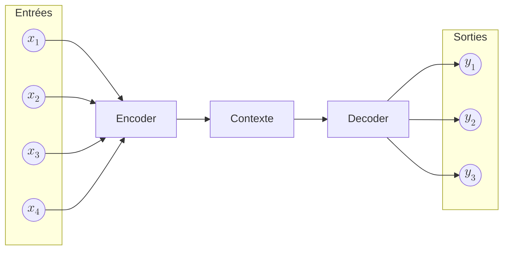

On considère une *séquence d’entrée* :

$$
(x_1, x_2, x_3, \dots, x_T)
$$

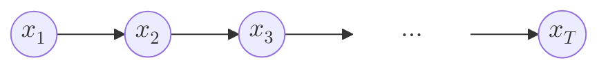

On définit également une *séquence de sortie* (*a priori* de longueur différente) :

$$
(y_1, y_2, y_3, \dots, y_{T'})
$$

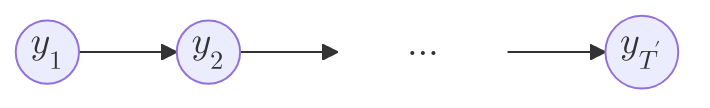

#### 1. Encodeur : construction du contexte global

L’encodeur traite la séquence d’entrée pas à pas :

$$
h_t = f_{\mathrm{enc}}(x_t, h_{t-1}), \quad t = 1, \dots, T
$$

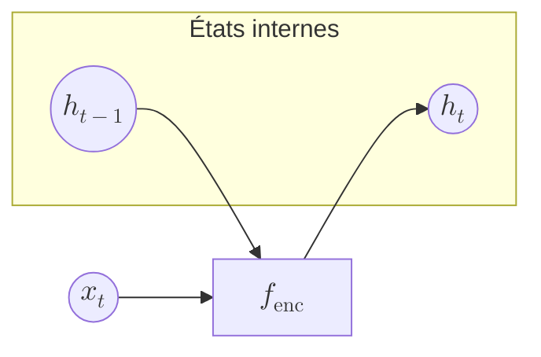

Le *contexte global unique* est alors défini comme :

$$
c = h_T
$$

Toute l’information de la séquence d’entrée est *compressée* dans ce vecteur.

---

#### 2. Décodeur : génération conditionnée par le contexte

Le décodeur est initialisé par le contexte :

$$
s_0 = c
$$

Puis, à chaque pas de temps, il génère un état interne :

$$
s_t = f_{\mathrm{dec}}(y_{t-1}, s_{t-1}), \quad t = 1, \dots, T'
$$

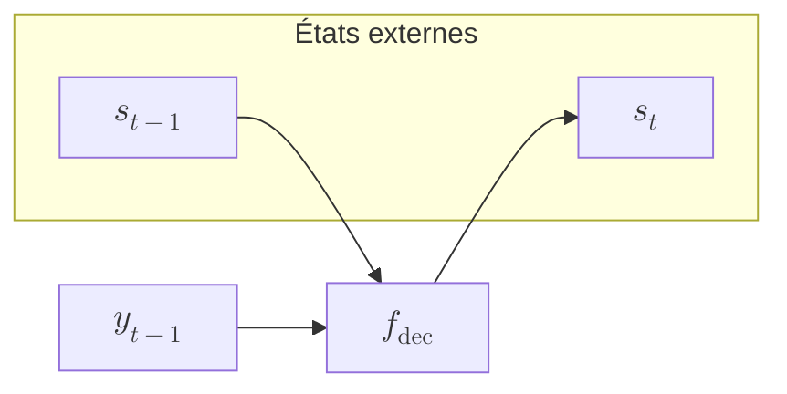

`softmax` qui transforme un *potentiel* $Wo$ en probabilité du token de sortie est donné par :

$$
P\!\left(y_t \mid y_{<t}, x_1, \dots, x_T\right) = \mathrm{softmax}(W_o s_t)
$$

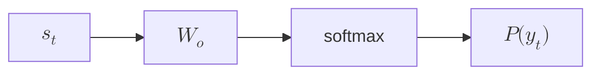

#### 3. Résumé fonctionnel

Le résumé fonctionnel du mécanisme est :

$$
\boxed{
\begin{aligned}
c &= \mathrm{Encoder}(x_1, \dots, x_T) \\
y_t &= \mathrm{Decoder}(y_{<t}, c)
\end{aligned}
}
$$

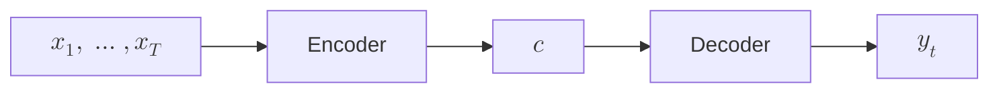

---

### Transition vers l’attention

Dans un modèle avec attention, le contexte devient *dépendant de t* :

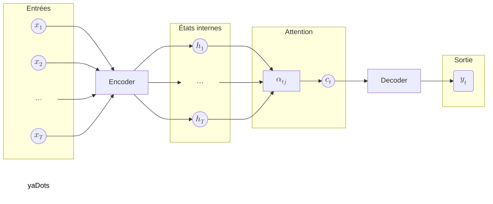

Cette dépendance temporelle se formalise par :

$$
c \longrightarrow c_t = \sum_j \alpha_{tj} h_j
$$

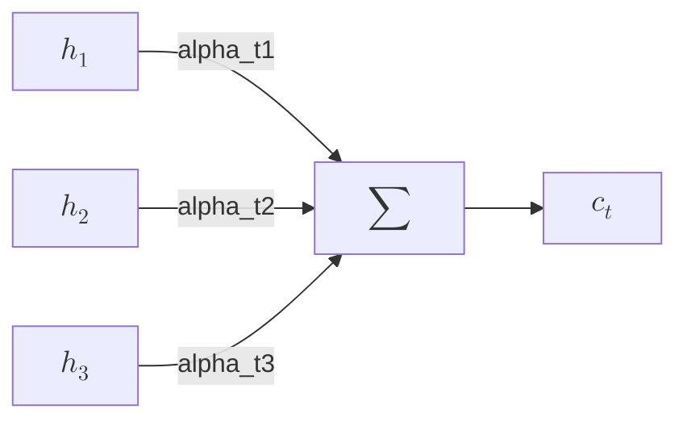

Chaque sortie reconstruit ainsi son propre contexte.

## Pondération locale du contexte

Le mécanisme d’attention remplace un *résumé global unique* par un *mécanisme de pondération locale*.

Formellement, pour chaque entrée $x_i$, la sortie associée est :

$$
y_i = \sum_j w_{ij} x_j
$$

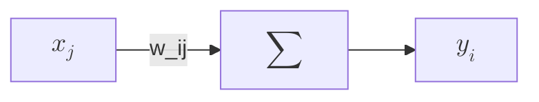

---

## Décomposition : query, key, value

* trois projections linéaires distinctes
* un mécanisme de comparaison
* une normalisation probabiliste
* une combinaison pondérée

Chaque xj :

* intervient comme key pour déterminer wij
* intervient comme value dans la somme finale
intervient comme query pour décider à qui prêter attention

Une même entrée 
x
x n’a pas un rôle unique
Elle est vue simultanément comme :

une question (query)

une clé de pertinence (key)

un contenu informationnel (value)

Ces trois rôles sont appris, séparés, et optimisés indépendamment.

Pour produire $y_i$, l’entrée $x_i$ est projetée en requête :

$$
q_i = W_q x_i
$$

C'est là que les formalisateurs du problème décident que ces trois rôles seront distingués par trois matrices différentes, apprises par optimisation. La sémantique des rôles d'une entrée est réalisée par des transformations adaptées de l'espace.

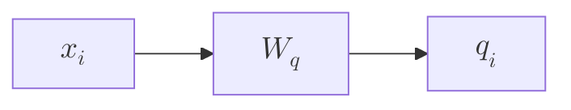

chaque entrée ( x ) intervient **de trois façons différentes**, selon qu’elle contribue :

1. au **calcul de la similarité**
2. au **calcul des poids**
3. à la **combinaison finale**

Ces rôles sont explicités par les notions de **query**, **key** et **value**.

---

### 1. Query — « ce que je cherche »

Pour produire ( y_i ), l’entrée ( x_i ) est transformée en une **requête** :

[
q_i = W_q x_i
]

Le vecteur **query** représente **ce que la position ( i ) cherche** dans le reste de la séquence.

👉 *Question implicite* :

> « À quelles autres positions dois-je prêter attention ? »

---

### 2. Key — « ce que je propose »

Chaque entrée ( x_j ) est aussi transformée en **clé** :

[
k_j = W_k x_j
]

Les **keys** décrivent **ce que chaque position ( j ) a à offrir**.

👉 *Réponse implicite* :

> « Suis-je pertinent pour la requête courante ? »

---

### Similarité query–key

La pertinence entre ( i ) et ( j ) est mesurée par un produit scalaire :

[
w'_{ij} = \langle q_i , k_j \rangle = q_i^T k_j
]

Puis normalisée :

[
w_{ij} = \frac{e^{w'*{ij}}}{\sum_j e^{w'*{ij}}}
]

**Interprétation** :

* ( w_{ij} \in [0,1] )
* ( \sum_j w_{ij} = 1 )
* ( w_{ij} ) mesure **l’attention que ( x_i ) accorde à ( x_j )**

---

### 3. Value — « l’information transmise »

Chaque entrée ( x_j ) est enfin projetée en **value** :

[
v_j = W_v x_j
]

Les **values** sont les **contenus réellement combinés** pour produire la sortie.

La sortie finale est :

[
y_i = \sum_j w_{ij} , v_j
]

👉 *Lecture clé* :
Les **keys décident *où regarder***,
les **values décident *quoi récupérer***.

---

## Schéma conceptuel — une position ( i )

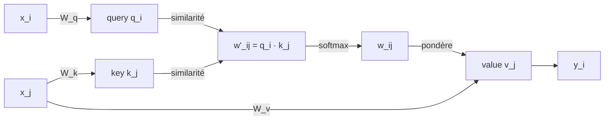

Chaque entrée $x_j$ est projetée en clé :

$$
k_j = W_k x_j
$$

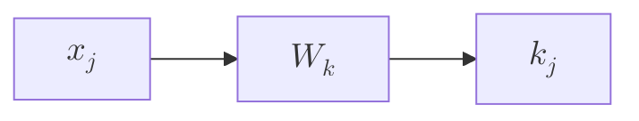

La similarité est donnée par :

$$
w'_{ij} = q_i^\top k_j
$$

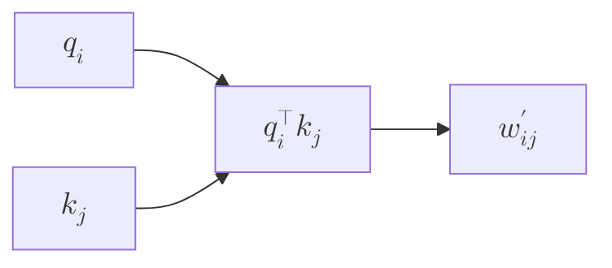

La normalisation softmax définit les poids :

$$
w_{ij} = \frac{\exp(w'_{ij})}{\sum_m \exp(w'_{im})}
$$

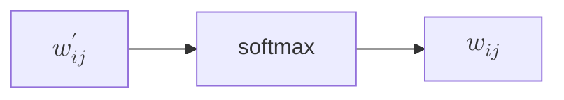

Les valeurs sont projetées par :

$$
v_j = W_v x_j
$$

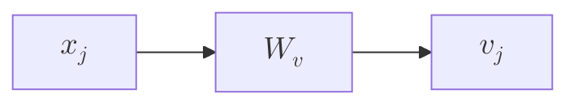

La sortie finale est :

$$
y_i = \sum_j w_{ij} v_j
$$

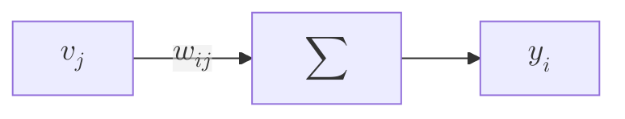

---

## À retenir

L’attention permet à chaque token de *définir un critère de similarité*, d’évaluer toutes les autres positions selon ce critère, puis de *combiner les informations pertinentes* pour construire une représentation contextuelle adaptée à la décision.
