## Mécanisme de l’attention

### Préambule

Le lecteur peu familier des mathématiques pourra se poser de nombreuses questions sur le pourquoi et le quoi de toutes ces équations. D'où viennent-elles ? L'informaticien habitué à la simulation se convaincra que les fonctions utilisées ci-dessous permettent de formaliser simplement le problème en laissant les aspects calculatoires à un algorithme général d'optimisation qui calculera l'appariement en l'entrée et la sortie, en approximant les fonctions implémentées.

Il s'agit ici d'une construction intellectuelle particulière : la réussite de l'apprentissage dépend de l'optimisation d'un formalisme imposé. Elle peut dérouter les personnes confortables avec l'idée qu'une machine déroule un programme conçu par l'humain. Pour l'apprentissage, elle optimise plutôt la formalisation réalisée par l'humain.

Lorsqu'on utilise cet axe de lecture et fait abstraction de la difficulté mathématique de l'optimisation, les éléments ci-dessous sont plus abordables.

Les concepteurs de ces systèmes ne manquent en tout cas pas d'imagination pour développer leurs structures, en valorisant des techniques primitives mais puissantes : transformation linéaires, non-linéaires, activation, qui ont prouvé leur expressivité. Quand on ne sait pas comment combiner plusieurs informations, en général on fait la somme avec des poids, ça et les transformations de potentiel en probabilité, c'est un peu la base.

### Seq2Seq sans attention

Historiquement, l’alignement de séquences d’items requiert l’insertion d’un encodeur/décodeur de *contexte*.

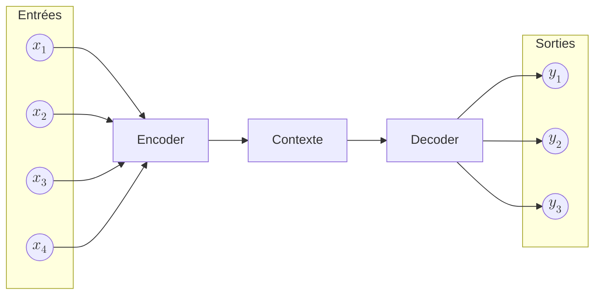

On considère une *séquence d’entrée* :

$$
(x_1, x_2, x_3, \dots, x_T)
$$

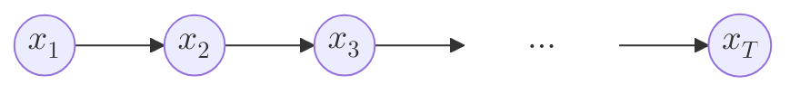

On définit également une *séquence de sortie* (*a priori* de longueur différente) :

$$
(y_1, y_2, y_3, \dots, y_{T'})
$$

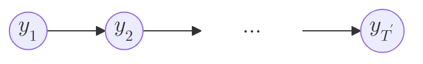

#### 1. Encodeur : construction du contexte global

L’encodeur traite la séquence d’entrée pas à pas :

$$
h_t = f_{\mathrm{enc}}(x_t, h_{t-1}), \quad t = 1, \dots, T
$$

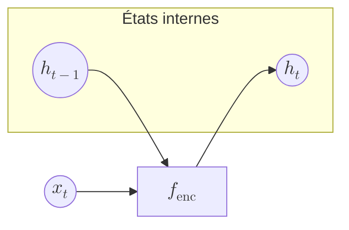

Le *contexte global unique* est alors défini comme :

$$
c = h_T
$$

Toute l’information de la séquence d’entrée est *compressée* dans ce vecteur.

---

#### 2. Décodeur : génération conditionnée par le contexte

Le décodeur est initialisé par le contexte :

$$
s_0 = c
$$

Puis, à chaque pas de temps, il génère un état interne :

$$
s_t = f_{\mathrm{dec}}(y_{t-1}, s_{t-1}), \quad t = 1, \dots, T'
$$

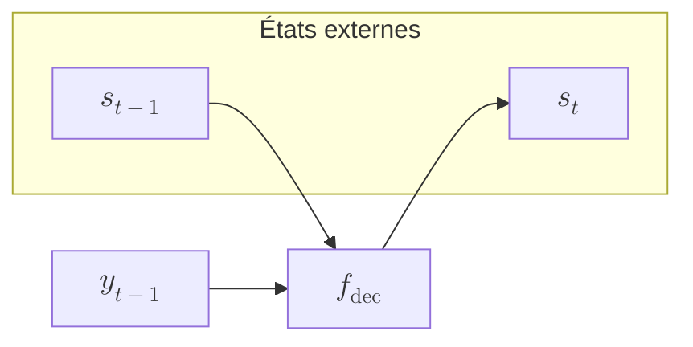

`softmax` qui transforme un *potentiel* $W_o s_t$ en probabilité du token de sortie est donné par :

$$
P\!\left(y_t \mid y_{<t}, x_1, \dots, x_T\right) = \mathrm{softmax}(W_o s_t)
$$

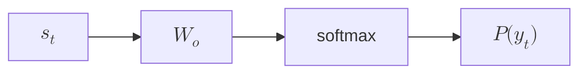

#### 3. Résumé fonctionnel

Le résumé fonctionnel du mécanisme est :

$$
\boxed{
\begin{aligned}
c &= \mathrm{Encoder}(x_1, \dots, x_T) \\
y_t &= \mathrm{Decoder}(y_{<t}, c)
\end{aligned}
}
$$

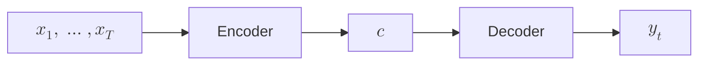

---

### Transition vers l’attention

Dans un modèle avec attention, le contexte devient *dépendant de t* :

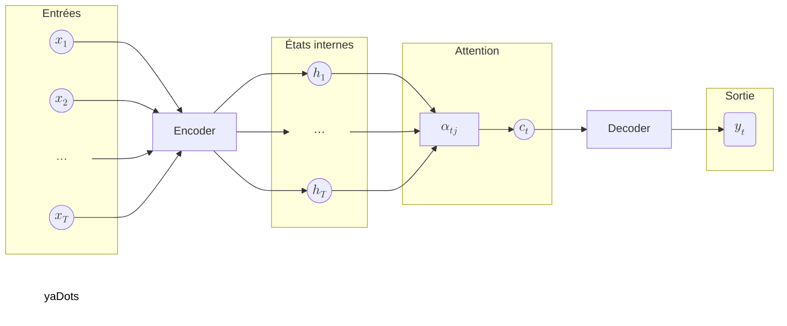

Cette dépendance temporelle se formalise par :

$$
c \longrightarrow c_t = \sum_j \alpha_{tj} h_j
$$

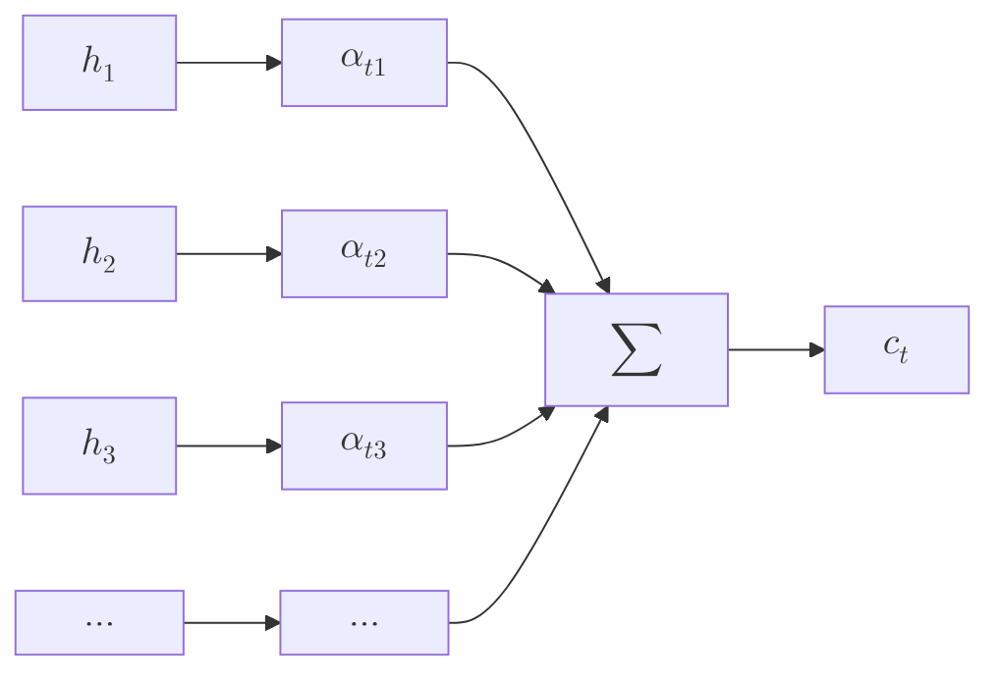

Chaque sortie reconstruit ainsi son propre contexte.

### Pondération locale du contexte

Le mécanisme d’attention remplace un *résumé global unique* par un *mécanisme de pondération locale*.

Formellement, pour chaque entrée $x_i$, la sortie associée est :

$$
y_i = \sum_j w_{ij} x_j
$$

```mermaid
flowchart LR
    xj["$$x_j$$"] -->|$$w_{ij}$$| sum["$$\sum$$"]
    sum --> yi["$$y_i$$"]
```

---

### Décomposition : query, key, value

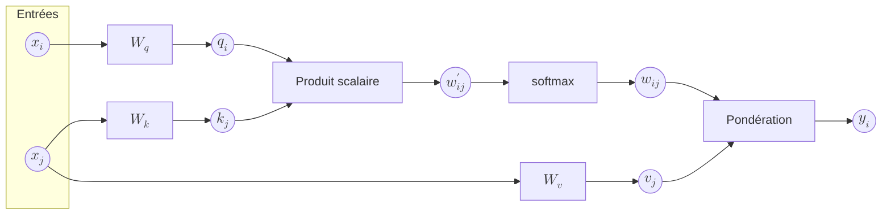

Les trois *rôles fonctionnels* assignés à une même entrée $x$ sont matérialisés par des projections linéaires distinctes. Elles confèrent à chaque position la capacité de chercher, d’évaluer et de synthétiser l’information pertinente dans la séquence.

### 1. Query — le signal de recherche

La *requête* de la position $i$ encode ce que cette position cherche dans le reste de la séquence :

$$
q_i = W_q x_i
$$

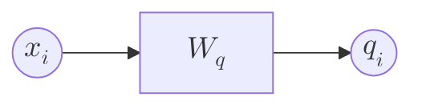

### 2. Key — le critère de pertinence

La *clé* associée à la position $j$ décrit ce que cette position peut offrir à une requête :

$$
k_j = W_k x_j
$$

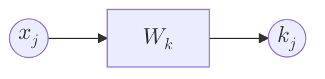

### 3. Similarité query–key

Le score de pertinence entre la requête $q_i$ et la clé $k_j$ est obtenu par produit scalaire :

$$
w'_{ij} = q_i^\top k_j
$$

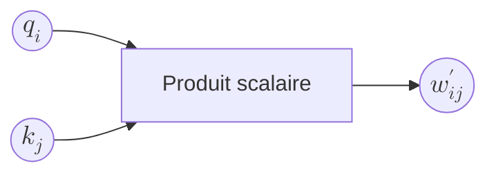

### 4. Normalisation des poids

Les scores sont transformés en *poids d’attention* via une normalisation softmax :

$$
w_{ij} = \frac{\exp(w'_{ij})}{\sum_m \exp(w'_{im})}
$$

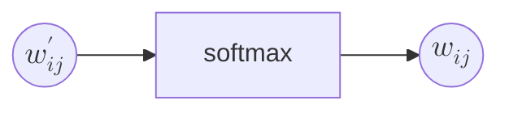

### 5. Value — le contenu combiné

La *valeur* associée à la position $j$ contient l’information effectivement agrégée :

$$
v_j = W_v x_j
$$

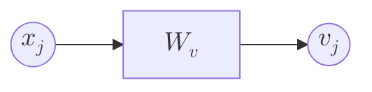

### 6. Agrégation pondérée

La sortie contextuelle $y_i$ est une combinaison des valeurs pondérées par les poids d’attention :

$$
y_i = \sum_j w_{ij} v_j
$$

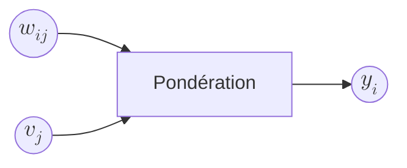

### Résumé fonctionnel

La synthèse opérationnelle de la décomposition $q$–$k$–$v$ est :

$$
\boxed{
\begin{aligned}
q_i &= W_q x_i \\
k_j &= W_k x_j \\
w_{ij} &= \mathrm{softmax}(q_i^\top k_j)_j \\
y_i &= \sum_j w_{ij} \, W_v x_j
\end{aligned}
}
$$

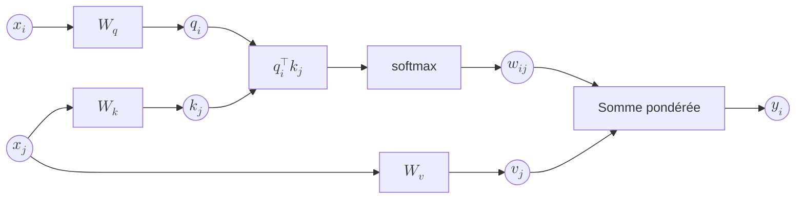

---

### À retenir

L’attention permet à chaque token de *définir un critère de similarité*, d’évaluer toutes les autres positions selon ce critère, puis de *combiner les informations pertinentes* pour construire une représentation contextuelle adaptée à la décision.
