## Mécanisme de l’attention

Historiquement, l’alignement de séquences d’items requiert l’insertion d’un encodeur/décodeur de *contexte*.

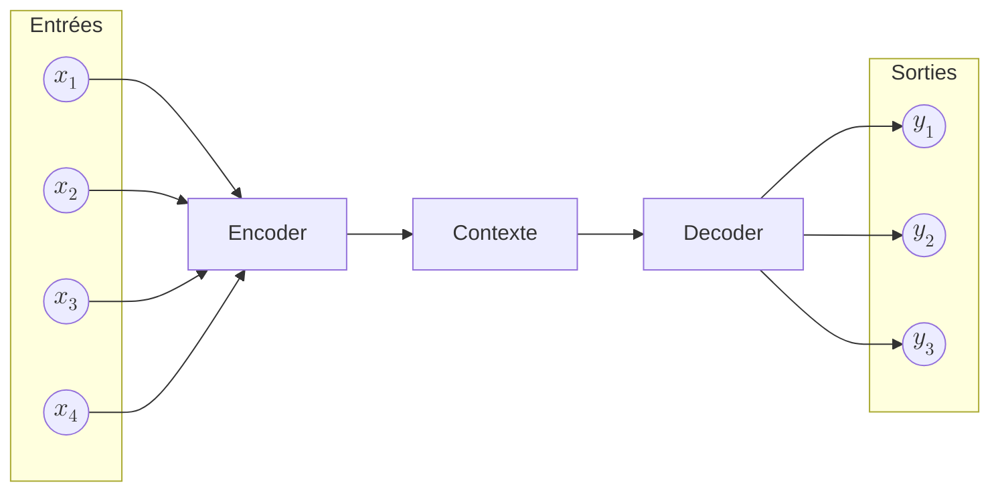

### Seq2Seq

On considère une *séquence d’entrée* :

$$
(x_1, x_2, x_3, \dots, x_T)
$$

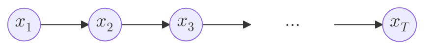

On définit également une *séquence de sortie* (*a priori* de longueur différente) :

$$
(y_1, y_2, y_3, \dots, y_{T'})
$$

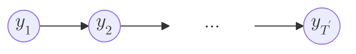

#### 1. Encodeur : construction du contexte global

L’encodeur traite la séquence d’entrée pas à pas :

$$
h_t = f_{\mathrm{enc}}(x_t, h_{t-1}), \quad t = 1, \dots, T
$$

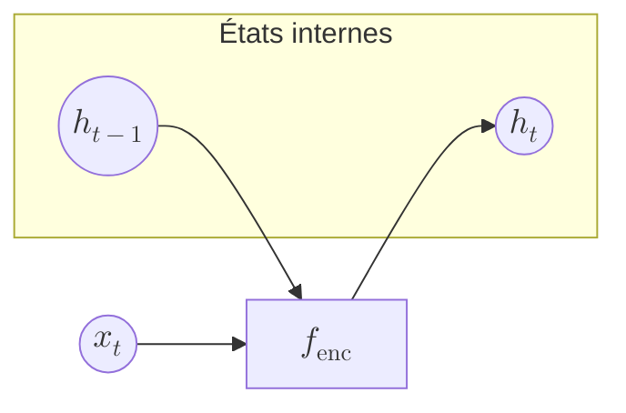

Le *contexte global unique* est alors défini comme :

$$
c = h_T
$$

Toute l’information de la séquence d’entrée est *compressée* dans ce vecteur.

---

#### 2. Décodeur : génération conditionnée par le contexte

Le décodeur est initialisé par le contexte :

$$
s_0 = c
$$

Puis, à chaque pas de temps, il génère un état interne :

$$
s_t = f_{\mathrm{dec}}(y_{t-1}, s_{t-1}), \quad t = 1, \dots, T'
$$

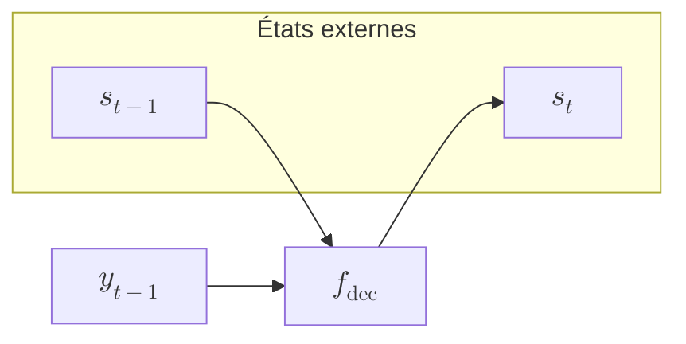

La probabilité du token de sortie est donnée par :

$$
P\!\left(y_t \mid y_{<t}, x_1, \dots, x_T\right) = \mathrm{softmax}(W_o s_t)
$$

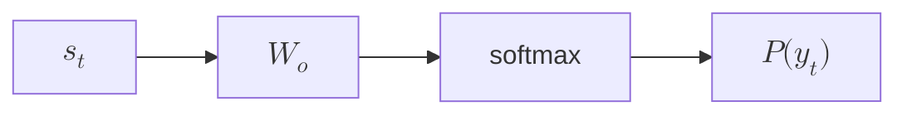

---

#### 3. Résumé fonctionnel

Le résumé fonctionnel du mécanisme est :

$$
\boxed{
\begin{aligned}
c &= \mathrm{Encoder}(x_1, \dots, x_T) \\
y_t &= \mathrm{Decoder}(y_{<t}, c)
\end{aligned}
}
$$

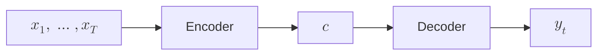

---

### Transition vers l’attention

Dans un modèle avec attention, le contexte devient *dépendant de t* :

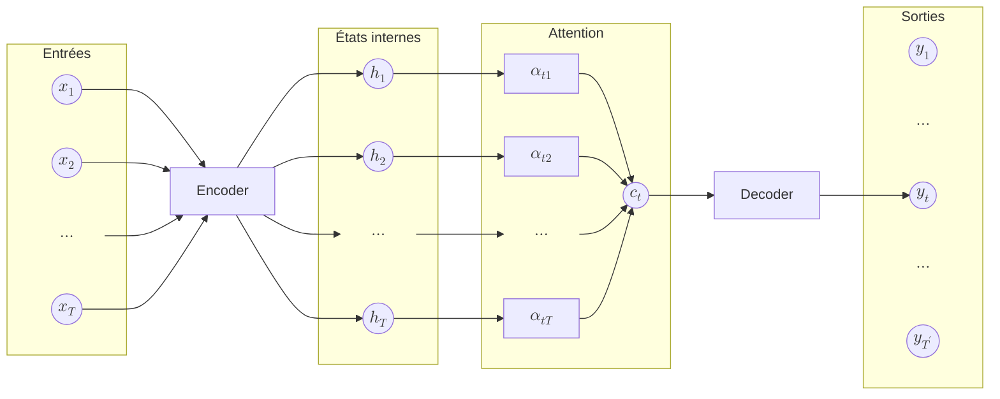

Cette dépendance temporelle se formalise par :

$$
c \longrightarrow c_t = \sum_j \alpha_{tj} h_j
$$

```mermaid
flowchart LR
    h1["$$h_1$$"] -->|$$\alpha_{t1}$$| sum["$$\sum$$"]
    h2["$$h_2$$"] -->|$$\alpha_{t2}$$| sum
    h3["$$h_3$$"] -->|$$\alpha_{t3}$$| sum
    sum2["$$\dots$$"] -->|$$\alpha_{tT}$$| sum
    sum --> ct["$$c_t$$"]
```

Chaque sortie reconstruit ainsi son propre contexte.

Le schéma récapitulatif suivant oppose le mécanisme sans attention et sa version attentive :

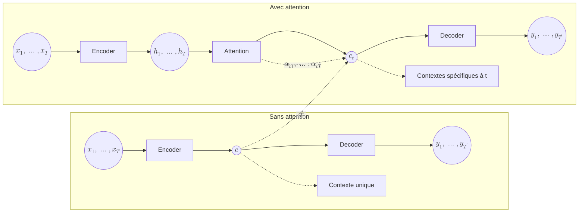

---

## Pondération locale du contexte

Le mécanisme d’attention remplace un *résumé global unique* par un *mécanisme de pondération locale*.

Formellement, pour chaque entrée $x_i$, la sortie associée est :

$$
y_i = \sum_j w_{ij} x_j
$$

```mermaid
flowchart LR
    xj["$$x_j$$"] -->|$$w_{ij}$$| sum["$$\sum$$"]
    sum --> yi["$$y_i$$"]
```

---

## Décomposition : query, key, value

Pour produire $y_i$, l’entrée $x_i$ est projetée en requête :

$$
q_i = W_q x_i
$$

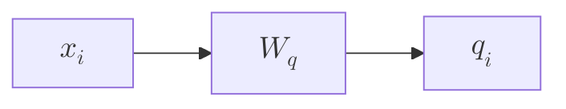

Chaque entrée $x_j$ est projetée en clé :

$$
k_j = W_k x_j
$$

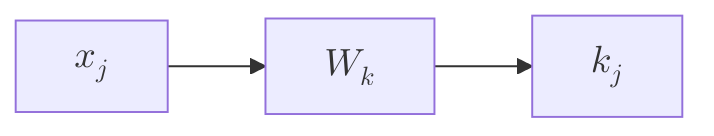

La similarité est donnée par :

$$
w'_{ij} = q_i^\top k_j
$$

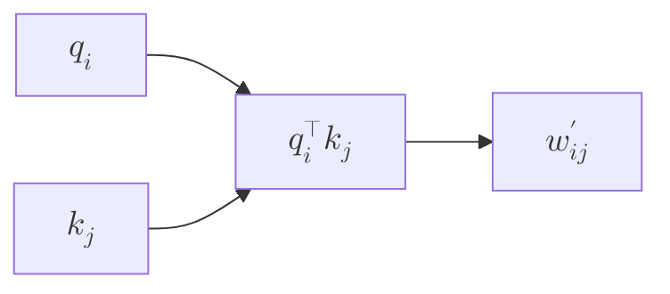

La normalisation softmax définit les poids :

$$
w_{ij} = \frac{\exp(w'_{ij})}{\sum_m \exp(w'_{im})}
$$

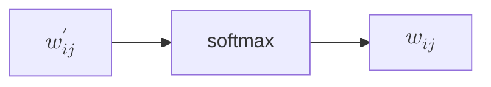

Les valeurs sont projetées par :

$$
v_j = W_v x_j
$$

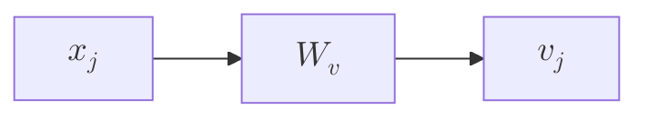

La sortie finale est :

$$
y_i = \sum_j w_{ij} v_j
$$

```mermaid
flowchart LR
    vj["$$v_j$$"] -->|$$w_{ij}$$| sum2["$$\sum$$"]
    sum2 --> yi["$$y_i$$"]
```

---

## À retenir

L’attention permet à chaque token de *définir un critère de similarité*, d’évaluer toutes les autres positions selon ce critère, puis de *combiner les informations pertinentes* pour construire une représentation contextuelle adaptée à la décision.
