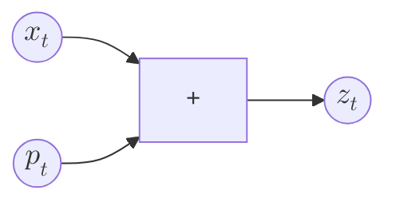
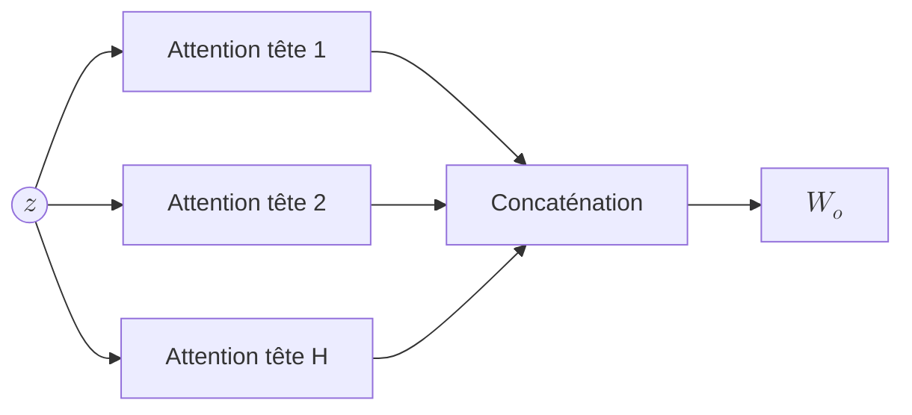
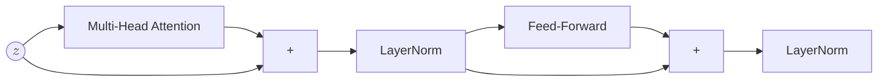
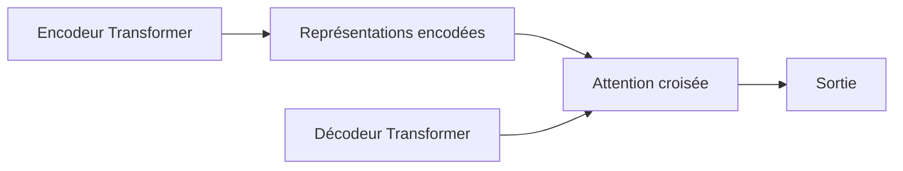

## Transformer

Un *Transformer* est un modèle de traitement de séquences qui repose exclusivement sur le mécanisme d’attention, sans recourir à une récurrence explicite ni à une convolution temporelle.

L’idée centrale est la suivante :

> au lieu de traiter les éléments d’une séquence pas à pas, le Transformer traite l’ensemble des positions simultanément, en laissant l’attention déterminer quelles interactions sont pertinentes.

La dépendance temporelle n’est donc plus imposée par l’architecture, mais apprise.

---

## Représentation d’entrée

Chaque élément de la séquence est représenté par un vecteur :

$$
(x_1, x_2, \dots, x_T)
$$

où chaque $x_t \in \mathbb{R}^d$ encode un token et ses attributs.

Comme l’attention est invariante par permutation, on ajoute une *information de position* à ces représentations afin de préserver l’ordre de la séquence.

Formellement, l’entrée réelle du modèle est :

$$
z_t = x_t + p_t
$$

où $p_t$ est un encodage de position (voir ...).

---

## Attention multi-têtes

Le cœur du Transformer est l’*attention multi-têtes*.
Elle consiste à appliquer plusieurs mécanismes d’attention en parallèle, chacun opérant dans un sous-espace différent.

Pour une tête d’attention, les projections sont définies par :

$$
q_i = W_q z_i, \quad k_j = W_k z_j, \quad v_j = W_v z_j
$$

et la sortie associée est :

$$
y_i = \sum_j \mathrm{softmax}(q_i^\top k_j)_j , v_j
$$

Dans le cas multi-têtes, on répète ce calcul pour $H$ têtes indépendantes :

$$
\text{head}_h(z) = \mathrm{Attention}_h(z)
$$

puis on concatène les résultats :

$$
\mathrm{MHA}(z) = W_o ,[\text{head}_1 | \dots | \text{head}_H]
$$

Chaque tête apprend ainsi à modéliser un type d’interaction différent entre positions.

---

## Bloc Transformer

Un *bloc Transformer* est une unité de calcul composée de deux sous-couches :

1. une attention multi-têtes (MHA)
2. un réseau feed-forward positionnel (FFN)

Chaque sous-couche est entourée d’un résidu additif et d’une normalisation.

Formellement, pour une entrée $z$ :

$$
z' = \mathrm{LayerNorm}(z + \mathrm{MHA}(z))
$$

$$
z'' = \mathrm{LayerNorm}(z' + \mathrm{FFN}(z'))
$$

Le réseau feed-forward est appliqué indépendamment à chaque position :

$$
\mathrm{FFN}(x) = W_2 ,\sigma(W_1 x)
$$

---

## Empilement et profondeur

Un Transformer complet est obtenu par empilement de $N$ blocs identiques :

$$
z^{(n+1)} = \mathrm{Block}(z^{(n)}), \quad n = 1, \dots, N
$$

La profondeur permet de construire progressivement des représentations de plus en plus abstraites, chaque couche recombine les informations issues des précédentes.

L'aspect *residual stream* d'un transformer à l'autre assure que le gradient ne disparaît pas.

---

## Encodeur et décodeur

Dans les tâches de type séquence-à-séquence, le Transformer est structuré en deux parties :

* un encodeur, composé uniquement de blocs Transformer
* un décodeur, qui ajoute une attention croisée vers les sorties de l’encodeur

L’*attention croisée* permet à chaque position de sortie de pondérer les représentations de l’entrée.

---

## Différence conceptuelle avec les modèles séquentiels

Dans un Transformer :

* aucune notion de pas de temps imposé
* toutes les positions interagissent directement
* la mémoire est distribuée dans les poids d’attention

L’*alignement* entre éléments de la séquence n’est plus une contrainte architecturale, mais un résultat appris.

NB : Même si l'ordre apparaît ne pas importer, il faut se souvenir de :

* encodage positionnel
* 

---

## À retenir

Le Transformer remplace :

* la récursion par l’attention
* le contexte global par des interactions locales apprises
* le déroulement séquentiel par un calcul parallèle

L’attention n’est pas un composant du Transformer :
elle en est le principe organisateur.
