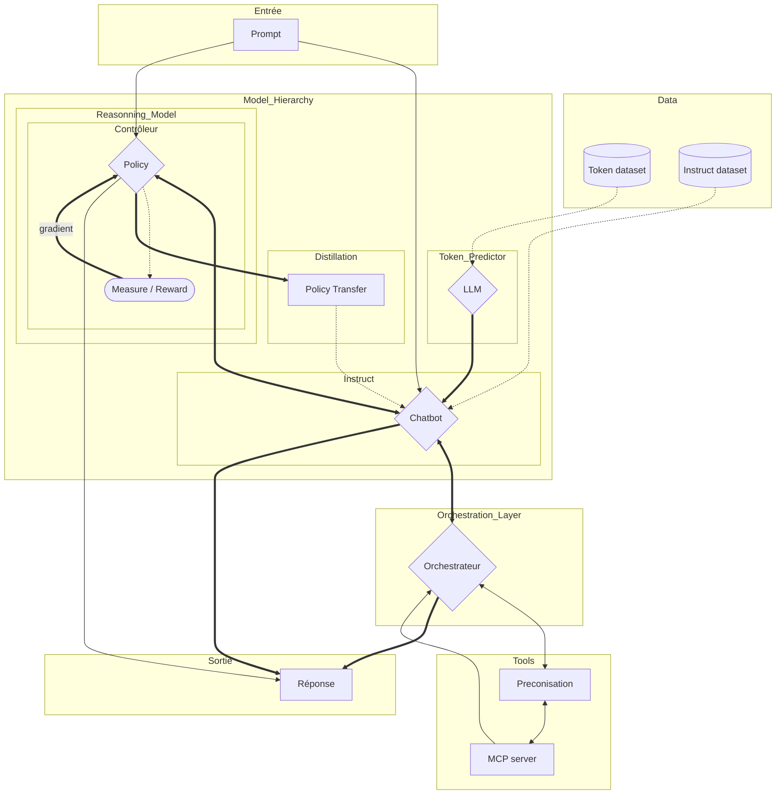
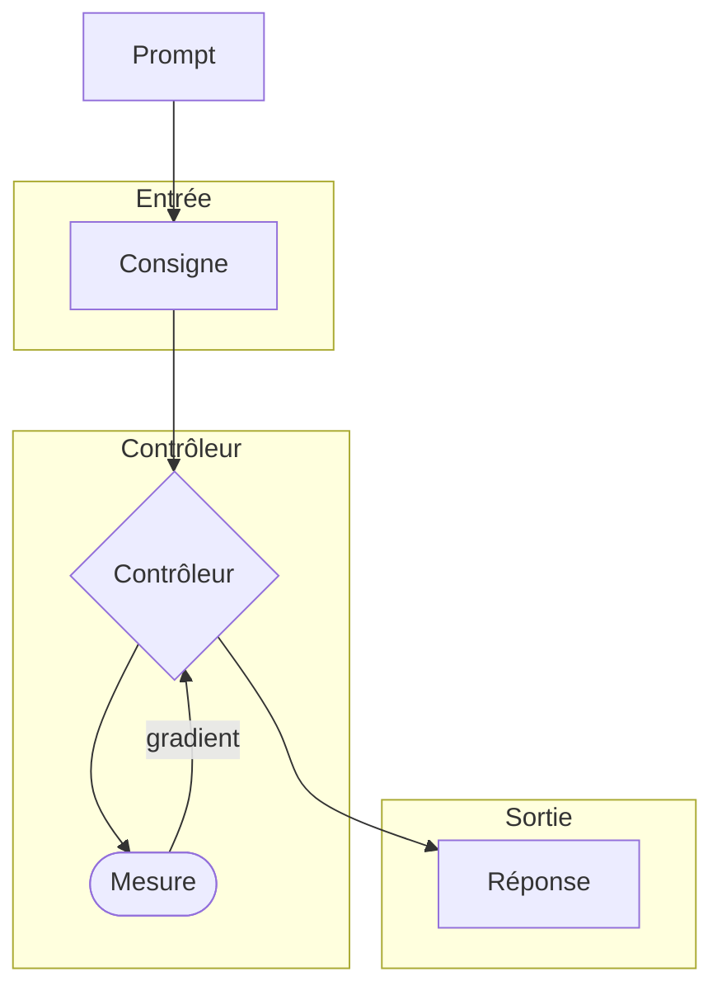
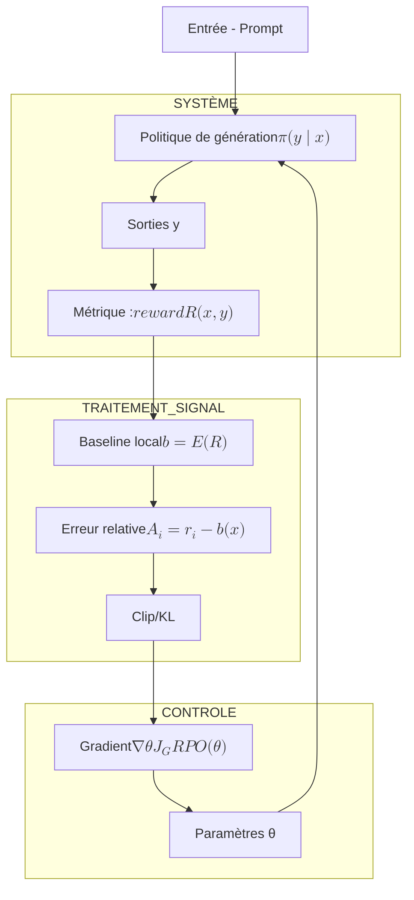

---
author:
- François Rioult
lang: fr
title: Application des LLM
subtitle: Hiérarchie des modèles
---

l’orchestration est une couche logicielle conceptuelle et architecturale, souvent réalisée par des frameworks qui peuvent utiliser des modèles pour planifier ou décider, et non simplement pour générer du texte.

compromis exploration/ ... RL
Il y a deux types de vérificateurs que nous allons étudier :
• Les Modèles de récompense des résultats (ORM pour Outcome Reward Models)
• Les Modèles de récompense des processus (PRM pour Process Reward Models)
Les ORM ne jugent que le résultat et ne se préoccupe pas du processus sous-jacent 

[Guide visuel modèle raisonneurs](https://lbourdois.github.io/blog/LLM_raisonnement/?utm_source=chatgpt.com)

o1 : “raisonnement via RL à grande échelle”, détails internes non publics.

DeepSeek-R1 : RL centré sur GRPO, une mise à jour par comparaison intra-groupe (souvent vue comme plus simple/efficiente que PPO avec critic).

Bandits : soit la formulation outcome (contextual bandit), soit un outil pour le curriculum/data scheduling

Dans GRPO, l’architecture sémantique reste très proche de celle de PPO, mais avec un signal d’erreur centré sur le groupe plutôt que sur un critic appris. 
Donc : GRPO est bien une variante de policy gradient (famille REINFORCE/PPO-like), mais avec baseline/avantage calculé par comparaison intra-groupe plutôt qu’un critic appris.

    Systèmes de règles explicites (code, pipelines)

    Graphes de tâches & DAG

    Contrôleurs de flux dirigés

    Modèles de décision ou politiques (parfois entraînés, parfois codés)

flowchart TD
    subgraph Model Hierarchy
    subgraph Instruct
        instruct([Instruct dataset]) --> chatbot
    end
    subgraph Token predictor
    token([token dataset])--> LLM
  LLM{LLM} --> chatbot{Chatbot - instruct}
  end
  subgraph Orchestration
  LAM[Large action model] --> orchestration
    chatbot --> orchestration
  end
end

Comparaison avec une vraie boucle d’asservissement

En régulation classique, on a :

* Entrée de consigne
* Action du contrôleur
* Mesure de sortie / erreur
* Traitement du signal d’erreur
* Mise à jour du contrôleur

Ici :

La sortie est un ensemble de réponses à partir d’une politique stochastique (plusieurs actions possibles).

La récompense agrégée joue le rôle d’une mesure finale de performance.

Le calcul de baseline puis d’avantage est l’équivalent de centrage / filtrage du signal.

L’étape d’optimisation avec clipping/KL est l’équivalent d’un compensateur + limiteur dans un schéma d’asservissement pour éviter les oscillations ou erreurs trop fortes.

Contrairement à un système automatique strictement causal, ici la mesure du signal (reward) n’est pas continue en temps réel mais globale par réponse complète, ce qui est typique des RL “bandit contextuel”.

GRPO remplace le critic traditionnel de PPO par une normalisation du signal par groupe de sorties, ce qui donne une estimation de l’avantage sans réseau de valeur.

La politique πθπθ​ est le modèle génératif lui-même, mais vu comme un agent RL :

    elle reçoit le prompt comme état/context

    elle génère la réponse comme action

    elle est récompensée par le reward model (corrélé aux préférences humaines)

    elle est mise à jour via une méthode d’optimisation (PPO ou une variante) pour augmenter l’espérance de récompense

# Distillation

# Préconisation d'outil

Dans beaucoup de systèmes modernes, les modèles de préconisation sont effectivement le résultat d’une distillation : on extrait une politique décisionnelle stable à partir d’un processus de raisonnement plus riche (LLM avec contrôle, exploration, outils), afin d’obtenir un modèle rapide, peu variable et directement actionnable.

Cependant, la préconisation peut aussi provenir d’un apprentissage direct (supervisé ou par imitation) sans teacher explicite, ou d’un raisonnement toujours présent mais contraint par l’orchestration ou le prompt. Dans ces cas, le comportement ressemble à un modèle distillé, mais le mécanisme n’en est pas un.

La préconisation n’est pas une tâche primaire bien définie comme la modélisation du langage ou la classification. Elle correspond à une politique décisionnelle dans un contexte donné. Les données utilisées pour l’entraîner sont donc presque toujours dérivées :

– logs d’actions humaines ou systèmes (ce qui a été fait, pas “ce qu’il fallait faire”),
– trajectoires produites par un raisonneur, un agent ou un système outillé,
– décisions validées a posteriori (feedback, succès/échec, préférences),
– données métier déjà orientées décision (règles, workflows, historiques).

La distillation n’est donc pas une condition nécessaire à la préconisation, mais c’est aujourd’hui le mécanisme industriel dominant pour la produire.