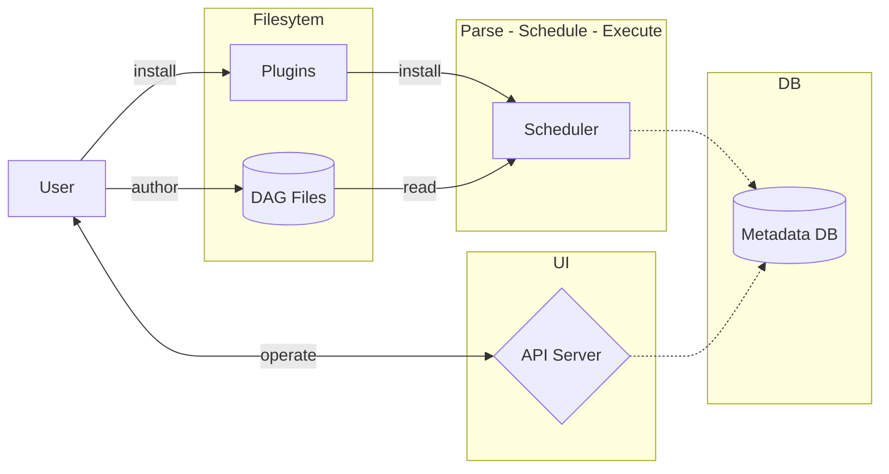

# Concepts de l'orchestration

Voici une **description sommaire** des trois principaux mécanismes de *control flow* dans un DAG Airflow, tels qu’ils sont exposés dans la documentation :

## Branching

* c’est une forme de condition dans l’exécution du DAG
* au lieu d’exécuter toutes les tâches suivantes, la logique de *branching* choisit un chemin parmi plusieurs possibles en fonction d’une condition qui retourne *un identifiant de tâche ou une liste*
* les branches non sélectionnées sont marquées *skipped*, ce qui influence l’état des tâches suivantes si leurs règles de déclenchement ne tiennent pas compte du *skip*
* brancher des chemins permet d’éviter l’exécution de tous les chemins quand ce n’est pas nécessaire, et de guider dynamiquement l’ordonnancement dans le DAG.

## Trigger rules

* c’est un mécanisme qui définit **quand une tâche peut s’exécuter** en fonction de l’état de ses dépendances
* par défaut, une tâche attend que *toutes* ses tâches en amont aient réussi avant de s’exécuter
* une règle de déclenchement différente (par exemple *one_success* ou *all_done*) permet de déclencher la tâche même si certaines dépendances ont été ignorées ou ont échoué
* ces règles sont configurables sur chaque tâche et permettent de moduler finement l’ordre d’exécution et le comportement du DAG lorsqu’il y a des branches, des échecs ou des *skips*.

## Setup et teardown

* ce sont des relations qui permettent d’exprimer des opérations **avant** et **après** un groupe de tâches
* une *task de setup* s’exécute avant les tâches qu’elle précède ; une *task de teardown* s’exécute après que ces tâches ont fini
* même si certaines des tâches “au milieu” échouent ou sont ignorées, Airflow fera tout de même exécuter le *teardown* si au moins une des *setups* a réussi
* ces relations sont utiles pour préparer l’environnement (ex : provisionner une ressource) puis nettoyer (ex : déprovisionner), sans dupliquer de logique dans le DAG.

Dans tous les cas, ces mécanismes modifient la **logique de synchronisation** par rapport à l’exécution linéaire “tout doit réussir pour passer à la suite”. Ils permettent à un DAG d’exprimer des flux conditionnels, des regroupements de tâches pré/post, ou des règles de dépendances plus flexibles. 

# Concepts `airflow`

`airflow` orchestre des *workflow* écrits en Python, découpés en *tâches*. L'écriture en Python permet d'accéder à toutes les bibliothèques imaginables, APIs et système de fichier entre autres. C'est une aternative libre à `n8n`, avec une interface dédiée à la gestion de tâches mais pas à leur rédaction : les composants (DAG) doivent être codés dans des fichiers. 

Les flow sont constitués de *tâches*, une fonction Python avec un décorateur `@task`. Une tâche peut être un élément d'orchestration (?). Un DAG peut générer dynamiquement des tâches. Par exemple <http://127.0.0.1:8080/dags/example_branch_operator/code>. Intération dynamique ?



## Control Flow

By default, a Dag will only run a Task when all the Tasks it depends on are successful. There are several ways of modifying this, however:

    * Branching - select which Task to move onto based on a condition

    ```py
@task.branch(task_id="branch_task")
def branch_func(ti=None):
    xcom_value = int(ti.xcom_pull(task_ids="start_task"))
    if xcom_value >= 5:
        return "continue_task"
    elif xcom_value >= 3:
        return "stop_task"
    else:
        return None
    ```

    * Trigger Rules - set the conditions under which a Dag will run a task

    * Setup and Teardown - define setup and teardown relationships

    * Latest Only - a special form of branching that only runs on Dags running against the present

    * Depends On Past - tasks can depend on themselves from a previous run

# DAGs

Trois façons de les déclencher : CLI, the REST API or the UI

A Dag is a model that encapsulates everything needed to execute a workflow. Some Dag attributes include the following:

*    Schedule: When the workflow should run.
*    Tasks: tasks are discrete units of work that are run on workers.
*    Task Dependencies: The order and conditions under which tasks execute.
*    Callbacks: Actions to take when the entire workflow completes.
*    Additional Parameters: And many other operational details.

## Dag Dependencies

While dependencies between tasks in a Dag are explicitly defined through upstream and downstream relationships, dependencies between Dags are a bit more complex. In general, there are two ways in which one Dag can depend on another:

* triggering - TriggerDagRunOperator
* waiting - ExternalTaskSensor

## Tasks

* Operators, predefined task templates
    * bash
    * python
    * datetime
    * empty (pour s'entraîner)
    * latest_only
    * trigger_dagrun

    * airflow.providers.common.sql.operators.generic_transfer.GenericTransfer

* Sensors, a special subclass of Operators which are entirely about waiting for an external event to happen.
    * bash
    * python
    * filesystem
    * date_time
    * external_task
* Hooks (?) : filesystem, subprocess

 Task Instance are: none, scheduled, queued, running, success, restarting, skipped, failed, upstream_failed, up_for_retry, up_for_reschedule, deferred, removed.

 Ideally, a task should flow from none, to scheduled, to queued, to running, and finally to success

### Relationships

The key part of using Tasks is defining how they relate to each other - their dependencies, or as we say in Airflow, their upstream and downstream tasks.

```python
first_task >> [second_task, third_task]
fourth_task << third_task

# Or, with the set_upstream and set_downstream methods:

first_task.set_downstream([second_task, third_task])
fourth_task.set_upstream(third_task)
```

## Operators

An Operator is conceptually a template for a predefined Task, that you can just define declaratively inside your Dag:

deux façons de déclarer les opérateurs :

```python
@task.bash(env={"message": '{{ dag_run.conf["message"] if dag_run.conf else "" }}'})
def bash_task() -> str:
    return "echo \"here is the message: '$message'\""


# ou bien 


bash_task = BashOperator(
    task_id="bash_task",
    bash_command="echo \"here is the message: '$message'\"",
    env={"message": '{{ dag_run.conf["message"] if dag_run.conf else "" }}'},
)

```

On peut utiliser des templates [`jinja`](https://airflow.apache.org/docs/apache-airflow/stable/core-concepts/operators.html#concepts-jinja-templating).

An Operator is conceptually a template for a predefined Task, that you can just define declaratively inside your Dag:

```python
with DAG("my-dag") as dag:
    ping = HttpOperator(endpoint="http://example.com/update/")
    email = EmailOperator(to="admin@example.com", subject="Update complete")

    ping >> email
```

### Skipping

In general a non-zero exit code produces an AirflowException and thus a task failure. In cases where it is desirable to instead have the task end in a skipped state, you can exit with code 99 (or with another exit code if you pass skip_on_exit_code).

### Output processor

The output_processor parameter allows you to specify a lambda function that processes the output of the bash script before it is pushed as an XCom.

Permet de générer du JSON.

```python
@task.bash(output_processor=lambda output: json.loads(output))
def bash_task() -> str:
    return """
        jq -c '.[] | select(.lastModified > "{{ data_interval_start | ts_zulu }}" or .created > "{{ data_interval_start | ts_zulu }}")' \\
        example.json
    """
```

### Autres opérateurs

* Bash
* BranchDateTime
* BranchDayOfWeek
* Human in the Loop (HITL) modeling approval steps or manual decision points within automated pipelines
* LatestOnly
* Python
* PythonVirtualenv
* ExternalPython
* BranchPython
* BranchPythonVirtualenv
* BranchExternalPython
* ShortCircuit
* TriggerDagRun

On trouve aussi des [providers](https://airflow.apache.org/docs/apache-airflow-providers/index.html) d'opérateurs : Email, HTTP, SQL, Hive, S3, HttpOperator, etc.

## Sensors

Sensors are a special type of Operator that are designed to do exactly one thing - wait for something to occur. It can be time-based, or waiting for a file, or an external event, but all they do is wait until something happens, and then succeed so their downstream tasks can run.

Because they are primarily idle, Sensors have two different modes of running so you can be a bit more efficient about using them:

* poke (default): The Sensor takes up a worker slot for its entire runtime
* reschedule: The Sensor takes up a worker slot only when it is checking, and sleeps for a set duration between checks

## TaskFlow 

TaskFlow takes care of moving inputs and outputs between your Tasks using XComs for you, as well as automatically calculating dependencies - when you call a TaskFlow function in your Dag file, rather than executing it, you will get an object representing the XCom for the result (an XComArg), that you can then use as inputs to downstream tasks or operators. For example:

## Connections & Hooks

Airflow is often used to pull and push data into other systems, and so it has a first-class Connection concept for storing credentials that are used to talk to external systems.

A Connection is essentially set of parameters - such as username, password and hostname - along with the type of system that it connects to, and a unique name, called the conn_id.

They can be managed via the UI or via the CLI; see Managing Connections for more information on creating, editing and managing connections. There are customizable connection storage and backend options.

A Hook is a high-level interface to an external platform that lets you quickly and easily talk to them without having to write low-level code that hits their API or uses special libraries.


# Écriture de DAGs

Tout bon modèle sait écrire des DAG `airflow`. Il suffit de bien expliquer ce qu'on veut interfacer, comment, dans quel ordre, quelles sont les dépendances, etc. Le code généré est léger, de haut niveau, court ; c'est plutôt de la description de tâches script puis un graphe d'orchestration :

```python
env = load_env(ENV_PATH)
IMAP_SERVER = env.get("IMAP_SERVER")
EMAIL_USER  = env.get("EMAIL_USER")
EMAIL_PASS  = env.get("EMAIL_PASS")

BASE_PATH     = "/home/rioultf/git/demain/airflow"
TMP_PATH      = f"{BASE_PATH}/tmp"
SCRIPT_PATH   = f"{BASE_PATH}/projectClassification.js"
PROMPT_PATH   = f"{BASE_PATH}/prompts/prompt2.md"
MODEL_ENV_VAR = "arcee-ai/trinity-large-preview:free"

default_args = {"owner": "you", "retries": 1}

with DAG(
    dag_id="imap_poll_classify_and_trigger",
    default_args=default_args,
    start_date=pendulum.today("UTC").add(days=-1),
    schedule="*/5 * * * *",
    catchup=False,
) as dag:

    @task()
    def fetch_emails():
        ...
        return emails

    def classify(body_text: str):
        ...
        return json.load(f)

    @task()
    def classify_emails(emails):
        for mail in emails:
            classification = classify(mail["body"])
            results.append({
                "email_id": mail["id"],
                "subject": mail["subject"],
                "from": mail["from"],
                "to": mail["to"],
                "classification": classification,
            })
        return results

    @task()
    def build_indexing_conf(classifications):
        # Renvoie un dict valide pour TriggerDagRunOperator
        return {"classifications": classifications}

    @task()
    def mark_as_seen(emails):
        for mail in emails:
            imap.store(mail["id"], "+FLAGS", "\\Seen")
        imap.logout()
        return f"Seen {len(emails)}"

    conf_dict = build_indexing_conf(classify_emails(fetch_emails()))

    trigger_indexing = TriggerDagRunOperator(
        task_id="trigger_indexing",
        trigger_dag_id="index_classification_to_sqlite",
        conf=conf_dict,   
        wait_for_completion=False,
    )

    # le DAG
    conf_dict >> trigger_indexing >> mark_as_seen(fetch_emails())
```

En plus, une tâche peut-être définie pour enchaîner avec une autre.

On a tendance à considérer l'orchestration de tâches selon notre propre modèle : on fait quand on peut et quand la tâche précédente est finie. `airflow` enchaîne directement les tâches.

Il faut se représenter une tâche comme un DAG, avec un début et une fin. Voir <https://www.astronomer.io/docs/learn/dags> pour des exemples.

## Operators

D'une façon générale, préférer l'usage de décorateurs plutôt que d'opérateurs (amenés à disparaître ?). Par ex.

```py
# préférer
@task.branch(task_id="branch_task")
def branch_func(ti=None):
    ...
# à l'emploi d'un opérateur
class MyBranchOperator(BaseBranchOperator):
    def choose_branch(self, context):
        ...
```

Similar like `@task.branch` decorator for regular Python code there are also branch decorators which use a virtual environment called `@task.branch_virtualenv` or external python called `@task.branch_external_python`.

### Latest Only

There are situations, backfill some data, where you don’t want to let some (or all) parts of a Dag run for a previous date; in this case, you can use the LatestOnlyOperator.

This special Operator skips all tasks downstream of itself if you are not on the “latest” Dag run (if the wall-clock time right now is between its execution_time and the next scheduled execution_time, and it was not an externally-triggered run).

## Trigger rules

By default, Airflow will wait for all upstream (direct parents) tasks for a task to be successful before it runs that task. You can control it using the trigger_rule argument to a Task. The options for trigger_rule are:


*    all_success 
*    all_failed
*    all_done
*    all_done_min_one_success
*    all_skipped
*    one_failed
*    one_success
*    one_done
*    none_failed
*    none_failed_min_one_success
*    none_skipped
*    always

## Divers

On peut mettre des labels sur les arêtes :

        my_task >> Label("When empty") >> other_task
        # ou
        my_task.set_downstream(other_task, Label("When empty"))

On peut mettre de la documentation dans un DAG :

```py
dag.doc_md = __doc__

t = BashOperator("foo", dag=dag)
t.doc_md = """\
#Title"
Here's a [url](www.airbnb.com)
"""
```


# Fil rouge

Pour un informaticien qui veut automatiser une simple tâche (pense-t-il), il faut finement découper la moindre phase.

Voici notre fil rouge :

1. imap poll
2. classification par LLM
3. indexation du résultat

La phase 3. mérite d'être découpée :

1. création si nécessaire de la base de données
2. indexation

# Mise en oeuvre

## Installation

Voir <https://airflow.apache.org/docs/apache-airflow/stable/start.html>

```bash
uv init airflow-demo
cd airflow-demo
uv venv
source .venv/bin/activate

AIRFLOW_VERSION=3.1.3
PYTHON_VERSION="$(python3 -c 'import sys; print(f"{sys.version_info.major}.{sys.version_info.minor}")')"
CONSTRAINT_URL="https://raw.githubusercontent.com/apache/airflow/constraints-${AIRFLOW_VERSION}/constraints-${PYTHON_VERSION}.txt"

uv pip install "apache-airflow==${AIRFLOW_VERSION}" --constraint "${CONSTRAINT_URL}"

# ne pas oublier
uv pip install openai

# lancer airflow pour obtenir la liste des commandes
AIRFLOW_HOME=`pwd` airflow

# lance l'environnement complet
AIRFLOW_HOME=`pwd` airflow standalone


# afficher la liste des dags
$ AIRFLOW_HOME=`pwd` airflow dags list

# dans un autre terminal
# récupérer le mot de passe de l'admin
cat simple_auth_manager_passwords.json.generated 
{"admin": "EvWDgmuKY2SgHdhs"}
```

Les dags pre-installés peuvent être supprimés (load_examples = False dans `airflow.cfg`). Il faut ensuite reconstruire la base de données :

    AIRFLOW_HOME=`pwd` airflow db reset


## Routine

`airflow` permet d'orchestrer des DAGs. Il faut découper toutes les étapes en petit DAGs.

Les questions initiales sont :

* quelles sont les entrées que l'on peut sonder (*poll*) : ici une boîte mail, mais ce pourrait être n'importe quel service qui fournit de l'information
* quelles sont les sorties que l'on peut activer ? `airflow` est orienté *fichier*, dont majoritairement il faut raisonner *fichier* pour les sorties, dans un premier temps une base de connaissance dans une base `sqlite`.

* créer un DAG
* relancer `airflow`
* vérifier que le DAG est correct (le code sera testé) :

```bash
airflow api-server
airflow dags list | grep ...
# en cas d'erreur
airflow dags list-import-error
```

## Important

* activer l'environnement `uv`

* positionner la variable `AIRFLOW_HOME` pour garder en local la base de données `airflow` et les crédits.

```bash
export AIRFLOW_HOME=`pwd`
airflow ...
# ou
AIRFLOW_HOME=`pwd` airflow ...
```

* relancer `airflow` en cas d'ajout d'un fichier DAG.

On définit des DAGs dans des fichiers Python, mais on peut aussi exécuter du bash. Les DAGs définissent des tâches qui écrivent des fichiers.

## Exécuter une tâche :

```bash
$ export AIRFLOW_HOME=`pwd`

airflow dags trigger classify_email   --conf '{"email_path": "/home/rioultf/git/demain/in/email_0005.md", "model": "arcee-ai/trinity-large-preview:free"}'
        |        |        | data_i |        |        | last_s |       |        |       |        | trigge
        |        |        | nterva | data_i |        | chedul | logic |        |       |        | ring_u
        |        | dag_ru | l_star | nterva | end_da | ing_de | al_da | run_ty | start |        | ser_na
conf    | dag_id | n_id   | t      | l_end  | te     | cision | te    | pe     | _date | state  | me    
========+========+========+========+========+========+========+=======+========+=======+========+=======
{'email | classi | manual | None   | None   | None   | None   | None  | manual | None  | queued | rioult
_path': | fy_ema | __2026 |        |        |        |        |       |        |       |        | f     
        | il     | -02-01 |        |        |        |        |       |        |       |        |       
'/home/ |        | T12:45 |        |        |        |        |       |        |       |        |       
rioultf |        | :50.87 |        |        |        |        |       |        |       |        |       
/git/de |        | 9573+0 |        |        |        |        |       |        |       |        |       
main/in |        | 0:00   |        |        |        |        |       |        |       |        |       
/email_ |        |        |        |        |        |        |       |        |       |        |       
0005.md |        |        |        |        |        |        |       |        |       |        |       
',      |        |        |        |        |        |        |       |        |       |        |       
'model' |        |        |        |        |        |        |       |        |       |        |       
:       |        |        |        |        |        |        |       |        |       |        |       
'arcee- |        |        |        |        |        |        |       |        |       |        |       
ai/trin |        |        |        |        |        |        |       |        |       |        |       
ity-lar |        |        |        |        |        |        |       |        |       |        |       
ge-prev |        |        |        |        |        |        |       |        |       |        |       
iew:fre |        |        |        |        |        |        |       |        |       |        |       
e'}     |        |        |        |        |        |        |       |        |       |        |       
```

# Logging

Le *loglevel* se situe dans le fichier de configuration de l'instance `airflow.cfg` :

Je conseille de faire passer tous les logs par WARN car INFO est déjà très généreux, puis de filtrer les WARN. De plus, le moindre log est accompagné de :

## Exemple

Sur le fichier [hello_world.py](dags/hello_world.py) :

1. Tâche `hello_task`

```
[2026-02-04 17:03:35] WARNING - Démarrage du DAG hello_world source=root loc=hello_world.py:13
[2026-02-04 17:03:35] WARNING - run_id=manual__2026-02-04T16:03:32+00:00 execution_date=None source=root loc=hello_world.py:14
[2026-02-04 17:03:35] WARNING - conf={} source=root loc=hello_world.py:16
[2026-02-04 17:03:35] WARNING - Hello Airflow, je logge aussi les traces maintenant source=root loc=hello_world.py:18
[2026-02-04 17:03:35] WARNING - Fin du DAG hello_world - statut success par défaut source=root loc=hello_world.py:19
```

2. Tâche `cat`

```
[2026-02-04 17:03:36] WARNING - Tâche cat - contenu reçu depuis XCom: source=root loc=hello_world.py:31
[2026-02-04 17:03:36] WARNING - {'status': 'success', 'run_id': 'manual__2026-02-04T16:03:32+00:00', 'execution_date': 'None', 'conf': {}, 'id': 5, 'name': 'toto'} source=root loc=hello_world.py:32
```

[2026-02-04 16:50:09] DEBUG - Calling 'on_starting' with {'component': <airflow.sdk.execution_time.task_runner.TaskRunnerMarker object at 0x795008097620>} source=airflow.listeners.listener loc=listener.py:37

```python
# hello_world.py

from airflow import DAG
from * python import PythonOperator
import pendulum
import logging

def hello_world():
    logging.info("Hello Airflow")

with DAG(
    dag_id="hello_world",
    start_date=pendulum.today("UTC").add(days=-1),
    schedule=None,
    catchup=False,
) as dag:
    hello_task = PythonOperator(
        task_id="hello_task",
        python_callable=hello_world,
    )
```

# Résumé synthétique

* `airflow standalone` démarre un environnement Airflow complet pour le développement local
* il lance automatiquement `api-server`, `scheduler` et `webserver`
* il initialise la base de métadonnées et crée un utilisateur administrateur
* il utilise une configuration simple et non adaptée à la production

Détails par composant

`api-server`

* *api-server* expose l’API REST d’Airflow
* il est utilisé par la CLI, l’interface web et les clients externes
* il gère l’accès à la base de métadonnées et le déclenchement des DAGs
* en Airflow 3, la CLI passe obligatoirement par `api-server`

`scheduler`

* *scheduler* analyse les DAGs et décide de leur exécution
* il scanne le dossier des DAGs et les parse
* il crée les `DagRun` et `TaskInstance`
* il envoie les tâches à l’executor
* sans `scheduler`, aucun DAG ne s’exécute

`webserver`

* *webserver* fournit l’interface graphique
* il consomme exclusivement l’API exposée par `api-server`
* il n’accède plus directement à la base en Airflow 3

`executor`

* *executor* exécute effectivement les tâches
* exemples courants : `SequentialExecutor`, `LocalExecutor`, `CeleryExecutor`

`airflow standalone`

* *standalone* est une commande tout-en-un orientée développement
* elle initialise la base de données
* elle crée un compte administrateur temporaire
* elle démarre `api-server`, `scheduler` et `webserver`
* elle utilise par défaut `SequentialExecutor` et SQLite
* elle affiche les identifiants admin dans le terminal
* elle n’est ni modulaire ni conçue pour la production


# Questions 


notion de [Deferrable Operators and Triggers](https://airflow.apache.org/docs/apache-airflow/stable/authoring-and-scheduling/deferring.html) deferrable operators" : la tâche se met en attente sans monopoliser un worker, et reprend quand un trigger reçoit l’entrée humaine

[HITLoperator : human in the loop](https://airflow.apache.org/docs/apache-airflow/stable/tutorial/hitl.html)
comment rendre les tâches indépendantes


* les dags pre-installés peuvent être supprimés (load_examples = False dans `airflow.cfg`). Il faut ensuite reconstruire la base de données.
