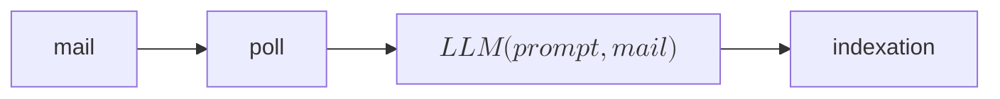

---
author:
- François Rioult
lang: fr
title: Application des LLM
subtitle: Indexation de mails
---
# Pipeline d’indexation de mails

`Airflow` orchestre 

* la collecte des emails 
* l’analyse via un LLM 
* l’enregistrement dans une base SQLite 



Le LLM est une brique dans ce pipeline, assigné à l'extraction d'information.

# DAGs

`Airflow` exécute des DAGs :

- écrits en Python ou `bash`
- scripts avec annotation
- expression des dépendances

# Prompt

Le but est de classer un email que je me suis envoyé à moi-même afin d’organiser des notes, idées, liens ou comptes rendus.
Ton rôle est de déterminer **le projet principal** auquel rattacher cet email.

---

## Projets (slugs canoniques)

Tu dois choisir **exactement un slug** parmi la liste suivante :

- **babbar** : INDYX, indexation de contenu, extraction de contenu web, graphes, GNN, signal, voisinage
- **aile** : Assistant Intelligent pour le Libre-Élan, parapente, aide à la décision, préparation de vol, météo / atmosphère
- **bmf** : Boolean Matrix Factorization, hypergraphes, traverses minimales, AFC, optimisation, ILP
- **dream** : analyse ou comparaison de récits de rêve ou d’éveil avec des LLM
- **demain** : mail as an instruct, agents, LLM, RAG, tooling
- **licpro** : pédagogie IA, supports de cours, vidéos (licence pro IA)
- **musique** : analyse musicale algorithmique, tonalité, visualisation musicale
- **sport** : analyse tactique (e-sport ou sport)
- **techtree** : visualisation d'arbre technologique sous l'angle écologique
- **divers** : hors périmètre ou non rattachable clairement

---

## Règles de décision (à respecter strictement)

1. **Le sujet (`subject`) est prioritaire**, surtout s’il est court ou laconique.
2. Si le sujet est générique (ex. *"suivi"*, *"notes"*, *"idée"*), utilise :
   - le contenu de l’email,
   - les tags éventuels,
   - les noms propres (personnes, projets, outils).
3. Classe l’email selon **le projet auquel la note peut raisonnablement être rattachée**.
4. S’il existe un doute réel ou si aucun projet ne correspond clairement, choisis **divers**.
5. Ne choisis **qu’un seul projet**.

---

## Email à analyser

Considère l’email suivant (au format Markdown).  
Prends en compte **l’entête** (`subject`, `from`, `to`, `date`) **et le contenu** :

<email>
{{file}}
</email>

---

Je suis tout le temps l'expéditeur. Si tu vois francois.rioult@unicaen.fr ou boita@boita.org, mets {from: "me", to: "me"}.

## Format de réponse (strict)

Ta réponse doit être **un objet JSON valide**, sans texte autour :

```json
{
  "project": "<projectSlug>",
  "justification": "<une phrase courte mentionnant l’indice décisif>",
  "abstract": "<un résumé des informations importantes dans le mail>",
  "subject": "<subject>",
  "from": "<from>",
  "to": "<to>"
}
```

⚠️ **IMPORTANT : Réponds uniquement par un objet JSON**
- **Commence par `{`**
- **Termine par `}`**
- **Aucune sortie textuelle avant ou après**
- **Aucune explication, aucun “Thinking”**

Le format doit être :

{
  "project": "...",
  "justification": "...",
  "abstract" : "...",
  "subject": "...",
  "from": "...",
  "to": "...",
}

# Pour aller plus loin

* les DAGs peuvent être générés par IA
* l'orchestration est pilotable par IA
* quelle responsabilité donner à l'agent ?
* est-ce vraiment utile ?
  * quel temps de développement ? 
  * combien de ressources de calcul ?
  * quel temps cela économise-t-il ?