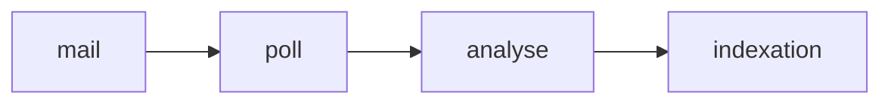

# Slide — Pipeline d’indexation de mails

## Architecture

Airflow orchestre la collecte des emails, l’analyse via un LLM et l’enregistrement dans une base SQLite pour garder une trace exploitable des conversations historiques. La composante « analyse » injecte toujours les résultats dans un prompt structurant qui guide la classification et la synthèse.

Chaque étape devient une discussion pédagogique : du fetch IMAP jusqu’à l’indexation, en passant par l’injection d’un prompt dans l’API `chat_completions`, on insiste sur la traçabilité des fichiers, prompts et résultats.
