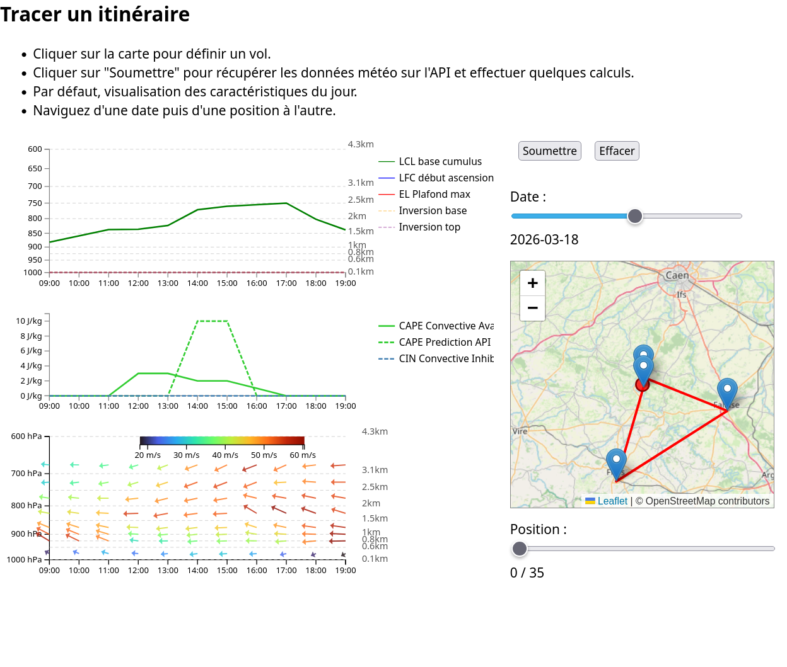
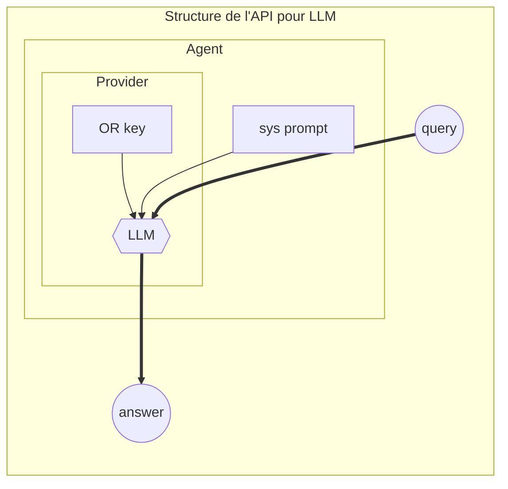
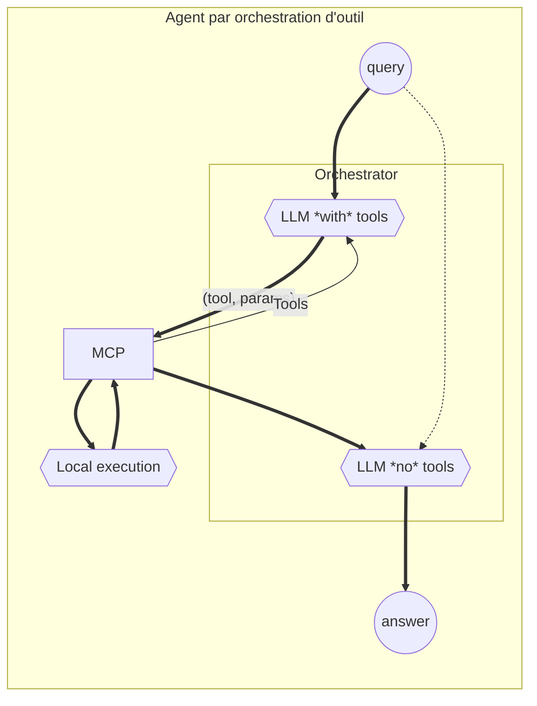

---
author:
- François Rioult
lang: fr
title: Application des LLM
subtitle: Agents MCP
---

# Objectif
- Accompagner la préparation de vol libre en délivrant un assistant dialoguant météo, NOTAM et conseils tactiques.
- Montrer comment un assistant LLM peut structurer une aide à la décision en combinant prompts, données aéronautiques et expertise humaine.
- 

# Architecture MCP

- Un endpoint MCP déclenche la collecte de données officielles (météo, aérologie, navigation) et les incorpore au prompt.
- Le prompt structuré est envoyé au LLM qui produit une réponse, enrichie par les outils, puis le serveur renvoie cette synthèse au pilote.
- MCP orchestre l’ensemble, expose les outils disponibles et permet de documenter chaque appel.






# Décomposition du modèle

Il importe de bien séparer 

* les connaissances du modèle : informations fixes
* ses capacités de traitement (manipulation de prompts, raisonnement, synthèse) : capacités dynamiques

Question : *comment être sûr que le modèle fera appel à l'outil ? et pas à ses connaissances ?*

# Le protocole MCP

Un protocole extrèmement simple : STDIO, le serveur du pauvre.
Un script modulant `stdout` avec `stdin` suffit, et les échanges sont en JSON-RPC :

```bash
while read line; do
    echo "$line" | jq -Rc '{jsonrpc:"2.0", id:1, result:{received:.}}'
done
```

-- insérer ici la vidéo --

# Services MCP

```python
# server.py
from mcp.server.fastmcp import FastMCP

# Create an MCP server
mcp = FastMCP("Demo")

# Add an addition tool
@mcp.tool()
def add(a: int, b: int) -> int:
    """Add two numbers"""
    return a + b

@mcp.tool()
def level(sensor: int) -> int:
    """Returns the level at given sensor"""
    if sensor == 1:
        return 10.0
    return 24.0
```


