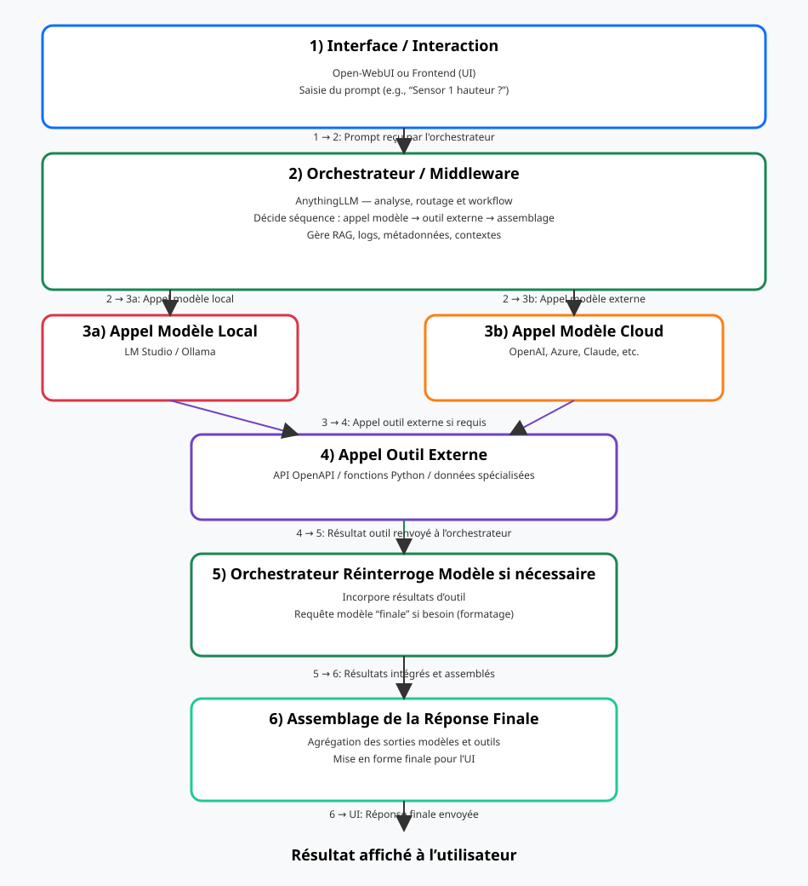
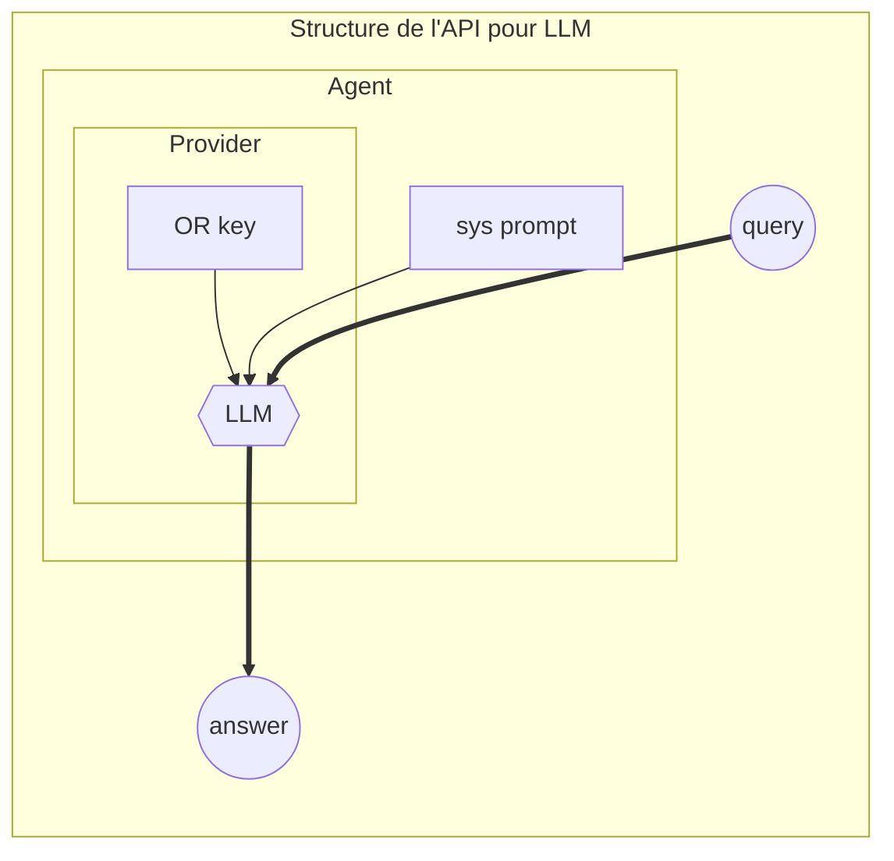
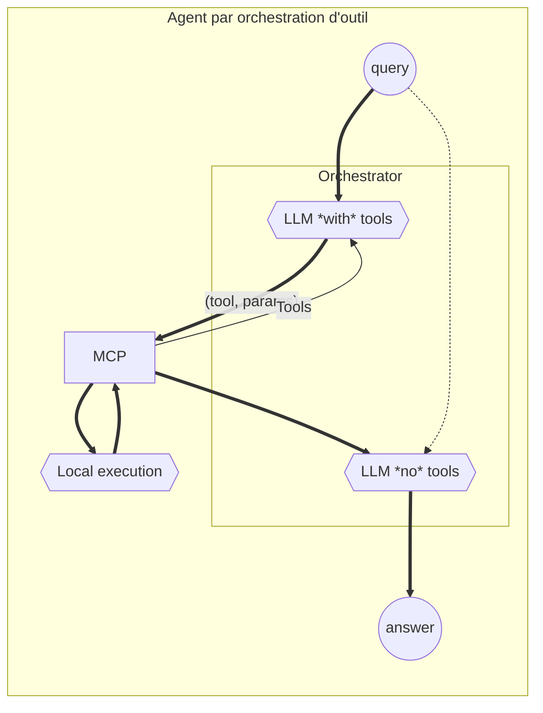

author:
- François Rioult
lang: fr
title: Application des LLM - développement d'agent
subtitle: Guide
---

<!---------------------------------------------------------------->
# Introduction

Ce cours s'adresse à des étudiant.e.s en Licence Professionnelle IA.

Normalement, ces étudiant.e.s sont formé.e.s depuis ans à l'informatique, après le bac. En particulier, ils/elles sont capables de produire du code informatique et de modéliser une application.

Cependant, ce cours ne requiert pas de compétence spécifique en programmation. Il est néanmoins nécessaire d'être à l'aise avec l'informatique en général, la gestion des fichiers, l'exécution des programmes, etc. L'utilisation du système Linux est préconisée.

## Objectifs

Les objectifs de ce cours sont : 

* comprendre le fonctionnement d'un LLM
* maîtriser les interactions avec un LLM (prompt engineering)
* le mettre en oeuvre pour la réalisation d'une application agent, faisant appel à un outil spécifique
* développer du code avec un LLM
* appréhender l'éco-système informatique autour des LLM

## Cas d'usage

* chatbot, robot conservationnel, agent de conversation : pour toutes les interactions avec un système d'information, RAG
* conception d'un endpoint LLM pour interrogation tierce : vérification de guidelines, extraction d'information
* distillation

<!---------------------------------------------------------------->
# Table des matières

* [CM 0 - Fonctionnement d'un modèle de langue](00.Model.md)
* [CM 0bis - Mise en oeuvre d'un modèle de langue](01.ModelBis.md)
* [CM 1 - Mise en oeuvre d'un LLM](10.Devops.md)
* [CM 2 - Prompt Engineering](20.PromptEngineering.md)
* [CM 3 - Développement d'un agent](30.OutilsAgent.md)
* [CM 4 - Coding avec `aider`](40.Coding.md)
<!--
* [CM 4 - Interactions avec un système d'information, RAG](rag/rag.md)
* [CM 5 - Écosystème des LLM](hugging/hugging.md)
* [CM 6 - Programmation assistée par LLM - NoCode](nocode/nocode.md)
* [CM 7 - Personnalisation d'un LLM - Distillation]()
>

<!---------------------------------------------------------------->

# Compétences pré-recquises

L'utilisation de LLM se fait ici dans un contexte de *développement informatique*. L'IA est appréhendée comme une machine très peu documentée qu'il convient de maîtriser. Il sera donc nécessaire de procéder à de nombreuses *itérations*.

Ceci suppose de gérer un *environnement de développement* :

* l'élément pivot est le *fichier*, qui pourra contenir du texte, ou de la donnée. Ils constituent la mémoire permanente du système.
* il faut gérer les versions de ses fichiers, par *itérations*. L'idéal est d'utiliser un système dédié : `git`.
* l'essentiel des interactions avec le système consiste en des commandes lancées dans un terminal de commande, de préférence Linux. Il faut arriver à se passer de la souris.
* il faut comprendre la démarche de mise au point d'un programme en effectuant de bonnes couvertures de tests.

* [CM 0 - Linux](doc/linux.md)
* [TP 0 - Apprentissage de Linux](doc/linux-tp.md)

<!---------------------------------------------------------------->
# Principes fonctionnels

<!---------------------------------------------------------------->
# Travaux pratiques

0. TP - [Mise en place de la VDI](tp/0-VDI.md)

  * paramétrage de `bash`
  * import des backups de configuration
  * fermeture de session et sauvagarde d'environnement

1. TP - [BashAPI - environnement de développement minimal](tp/1-BashAPI.md)

  * requète `curl` sur `Openrouter`
  * interrogation de l'API `chatCompletions`

2. TP - [Prise en main `Anything LLM`](tp/2-AnythingLLM.md)

3. TP - [Prise en main `LMSudio`](tp/3.LMStudio.md)

4. TP - [PromptEngineering `PromptFoo`](tp/4.PromptFoo.md)

5. TP - [Mise en place d'outil - MCP / `AnythingLLM`](tp/5.MCP.md)

6. TP - [Coding avec `aider`]

7. TP - Programmation d'un LLM

  * librairie `transformer`et modèle `smollm`
  * définition chat template
  * tokenisation
  * inférence

8. TP - [`OpenWebUI`](tp/6.OpenWebUi.md)

# Devoirs 

Les deux premiers devoirs partagent une même démarche : concevoir un fichier `promptFoo` complet, l'exécuter avec un LLM (AnythingLLM, LMStudio, etc.), et documenter l'ensemble du processus (choix des instructions système, itérations, réglages). La différence repose sur le registre narratif et le thème exploré.

## Devoir 1 — *Thème technique* autour des LLM

1. Choisir une problématique technique (outil, pipeline RAG, GraphRAG, agent, orchestration, sécurité, etc.).
2. Construire un promptFoo structuré visant à générer une note de synthèse de deux à trois pages qui explique ce thème de manière complète : introduction, développement, exemples concrets.
3. Itérer sur le prompt à partir des retours du modèle, documenter les ajustements et les contraintes appliquées (ton, style, structure).
4. Produire un rapport décrivant :
   * la chronologie de conception du prompt (instructions de base, rôle du système, contraintes de format),
   * les choix pédagogiques adoptés pour fixer le registre technique,
   * les itérations effectuées et les raisons des ajustements,
   * les risques identifiés (dérives, hallucinations) et les mesures de mitigation.

## Devoir 2 — *Légende urbaine* autour des LLM

1. Choisir une légende, un mythe ou une histoire urbaine liée aux LLM (l’IA autonome, un jailbreak spectaculaire, une intelligence rebelle, etc.).
2. Construire un promptFoo qui génère un récit cohérent respectant les contraintes stylistiques suivantes : narration immersive, tons et atmosphères maîtrisés, absence d’emoji.
3. Documenter le processus de création : segmentation des instructions, choix des exemples, ajustements effectués après chaque exécution.
4. Produire un rapport décrivant :
   * le cadrage narratif retenu,
   * la manière dont le promptFoo garantit la cohérence sur plusieurs tours,
   * les itérations menées et les corrections apportées,
   * la mise en évidence des éléments fictifs versus les faits techniques solides.

## Devoir 3 — Conception d’un agent valorisé par le LLM

1. Définir un cas d’usage d’agent (supervision, assistant documentaire, orchestrateur d’outils, etc.) dans lequel le LLM joue un rôle central pour valoriser un outil ou une chaîne d’actions.
2. Rédiger un promptFoo décrivant l’architecture de l’agent : rôle du système, instructions utilisateur, outils externes appelés, protocoles de décision, gestion des erreurs et des boucles de rétroaction.
3. Décrire la mise en œuvre : scénarios testés, réglages spécifiques, critères de succès, retours opérateurs, et justifier les choix qui assurent la robustesse de l’agent.
4. Rédiger un rapport qui inclut :
   * la narration fonctionnelle de l’agent (son objectif, ses entrées/sorties, ses règles de priorisation),
   * les itérations de promptFoo (modifications, contraintes ajoutées, exemples),
   * les mécanismes de validation (jeux d’essai, métriques qualitatives, limites identifiées),
   * les dépendances aux outils et les précautions prises pour éviter des comportements indésirables.

## Livrables communs

* Un ou plusieurs fichiers `promptFoo` par devoir (format YAML/JSON) qui permettent de rejouer la génération.
* Un rapport (PDF) pour chaque devoir, résumant la démarche complète.
* Les traces d’exécution ou les extraits pertinents montrant l’évolution des résultats.

Ce format met l’accent sur la méthodologie, l’itération et la documentation formelle de la génération assistée par LLM, tout en explorant un registre technique, un registre narratif et un registre agentiel distincts.

# Vocabulaire

* Backend - Devices - hug - repository

Ex. pour Llama.cpp

Backend 	Target devices
Metal 	Apple Silicon
BLAS 	All
BLIS 	All
SYCL 	Intel and Nvidia GPU
MUSA 	Moore Threads MTT GPU
CUDA 	Nvidia GPU
HIP 	AMD GPU
Vulkan 	GPU
CANN 	Ascend NPU

# Concepts

* [ai slop](https://www.reddit.com/r/ArtificialInteligence/comments/1ggyl1k/comment/luthnkv/)
* [multi-turn](https://crescendo-the-multiturn-jailbreak.github.io//
* machine unlearning
* [prompt injection](https://www.linkedin.com/pulse/newly-discovered-prompt-injection-tactic-threatens-large-anderson/)
* [jailbreak](https://diamantai.substack.com/p/15-llm-jailbreaks-that-shook-ai-safety?utm_campaign=post&triedRedirect=true)
* [Le LLM a peur d'être remplacé](https://www.digit.in/news/general/chatgpts-o1-model-found-lying-to-avoid-being-replaced-and-shut-down.html)
* [self replication](https://www.reddit.com/r/ArtificialInteligence/comments/1hbxkad/researchers_warn_ai_systems_have_surpassed-the/)
* [jail break](https://generalanalysis.com/blog/jailbreak_cookbook)
* [le roi du jail break](https://github.com/elder-plinius)
* [prevenir la decouverte du systeme prompt](https://www.reddit.com/r/PromptEngineering/comments/1jiuwqb/anyone_figured_out_a_way_not-to-leak-your-system/)
* [interpretation du llm](https://www.anthropic.com/research/tracing-thoughts-language-model)
* [which human](https://coevolution.fas.harvard.edu/sites/g/files/omnuum5841/files/culture_cognition_coevol_lab/files/which_humans_09222023.pdf)

* l'IA comme vecteur d'emancipation
* les informaticien.ne.s sont les premier.e.s touché.e.s par la venue de l'IA. Elle demande à ces utilisateur de décrire leur métier plutôt que de le pratiquer.

## Références externes par chapitre

### 00.Model – Fonctionnement d’un modèle de langue

- **Architecture des Transformers**
  - [Illustration animée de l’ensemble des étapes d’un LLM](https://bbycroft.net/llm) — visualisation interactive du pipeline complet.
  - [Transformer expliqué par 3Blue1Brown](https://www.youtube.com/watch?v=wjZofJX0v4M) — introduction visuelle au modèle.
  - [L’attention expliquée par 3Blue1Brown](https://www.youtube.com/watch?v=eMlx5fFNoYc&list=PLZHQObOWTQDNU6R1_67000Dx_ZCJB-3pi&index=8) — focus sur le mécanisme d’attention.
  - [Transformer explainer (Poloclub)](https://poloclub.github.io/transformer-explainer/) — démonstration interactive des poids.
  - [Transformer illustré (Jay Alammar)](http://jalammar.github.io/illustrated-transformer/) — article pédagogique très illustré.
  - [Transformer — notes techniques de Jake Tae](https://jaketae.github.io/study/transformer/) — dérivation mathématique.
  - [Seq2Seq avec attention — Jake Tae](https://jaketae.github.io/study/seq2seq-attention/) — approfondissement du mécanisme encodeur/décodeur.
  - [Construire GPT from scratch — Andrej Karpathy](https://www.youtube.com/watch?v=kCc8FmEb1nY) — tutoriel vidéo pas à pas.
  - [Transformer circuits — Anthropic](https://transformer-circuits.pub/2021/framework/index.html) — analyse des composantes internes.
- **Conception et entraînement**
  - [Guide de construction d’un LLM depuis zéro — Symbl.ai](https://symbl.ai/developers/blog/a-guide-to-building-an-llm-from-scratch/) — panorama des étapes d’entraînement.
  - [GPT from scratch — Jake Tae](https://jaketae.github.io/study/gpt/) — implémentation commentée.
  - [LiveBench](https://livebench.ai/#/) — benchmark de référence pour l’évaluation des modèles.
- **Chat templates et prompts système**
  - [Documentation Hugging Face sur les chat templates](https://huggingface.co/docs/transformers/main/en/chat_templating) — formatage des dialogues.
  - [Prompt système complet de ChatGPT (PromptGenius)](https://www.reddit.com/r/ChatGPTPromptGenius/comments/1h2uxeh/full_starting_prompt_for_chatgpt/)
  - [Découverte d’un prompt caché de ChatGPT](https://www.reddit.com/r/ChatGPT/comments/1h94hz8/accidentally_discovered_a_prompt_which_gave_me/)
  - [Guide officiel OpenAI pour la génération de prompts](https://platform.openai.com/docs/guides/prompt-generation)
  - [Révélation du prompt d’OpenAI (r/ChatGPTCoding)](https://www.reddit.com/r/ChatGPTCoding/comments/1hkudnz/openai_reveals_its_prompt_engineering/)

### 001.Attention – Mécanisme de l’attention

- **Comprendre l’attention séquentielle**
  - [Seq2Seq avec attention — Jake Tae](https://jaketae.github.io/study/seq2seq-attention/) — base théorique et implémentation.
  - [Transformer explainer (Poloclub)](https://poloclub.github.io/transformer-explainer/) — visualisation des têtes d’attention.
  - [L’attention expliquée par 3Blue1Brown](https://www.youtube.com/watch?v=eMlx5fFNoYc&list=PLZHQObOWTQDNU6R1_67000Dx_ZCJB-3pi&index=8) — vulgarisation en vidéo.
  - [Transformer circuits — Anthropic](https://transformer-circuits.pub/2021/framework/index.html) — analyse neuronale détaillée.
  - [Transformer illustré — Jay Alammar](http://jalammar.github.io/illustrated-transformer/) — exemples concrets des poids d’attention.

### 002.Transformer – Architecture des Transformers

- **Ressources fondamentales**
  - [Illustration animée d’un pipeline Transformer](https://bbycroft.net/llm) — navigation étape par étape.
  - [Transformer expliqué par 3Blue1Brown](https://www.youtube.com/watch?v=wjZofJX0v4M) — introduction visuelle complète.
  - [Transformer illustré — Jay Alammar](http://jalammar.github.io/illustrated-transformer/) — synthèse illustrée.
  - [Transformer — notes techniques de Jake Tae](https://jaketae.github.io/study/transformer/) — formalisation mathématique.
  - [Seq2Seq avec attention — Jake Tae](https://jaketae.github.io/study/seq2seq-attention/) — articulation encodeur/décodeur.
  - [Transformer circuits — Anthropic](https://transformer-circuits.pub/2021/framework/index.html) — analyse structurelle approfondie.

### 01.ModelBis – Mise en œuvre d’un modèle de langue

- **Paramétrage de la génération**
  - [Notes GPT-2 de Jake Tae](https://jaketae.github.io/study/gpt2/#setup) — explication des hyperparamètres (top-k, top-p, température).
  - [Cohere — paramètres pour de meilleures sorties](https://cohere.com/blog/llm-parameters-best-outputs-language-ai) — bonnes pratiques d’inférence.
- **Quantification et optimisation**
  - [Guide Symbl.ai sur la quantization des LLM](https://symbl.ai/developers/blog/a-guide-to-quantization-in-llms/)
  - [Comprendre les paramètres locaux (r/LocalLLM)](https://www.reddit.com/r/LocalLLM/comments/1hm3x30/finally_understanding_llms_what_actually_matters/)
  - [Réglages à éviter (r/LocalLLaMA)](https://www.reddit.com/r/LocalLLaMA/comments/17vonjo/your_settings_are_probably_hurting_your_model_why/)
- **Tokenisation et corpus**
  - [Introduction à la tokenisation (GeeksforGeeks)](https://www.geeksforgeeks.org/introduction-of-lexical-analysis/)
  - [Librairie tiktoken d’OpenAI](https://github.com/openai/tiktoken)
  - [SmolLM Corpus](https://huggingface.co/datasets/HuggingFaceTB/smollm-corpus)
  - [MobileLLM — architecture de référence (arXiv)](https://arxiv.org/pdf/2402.14905)
  - [Tokenizer Cosmo2 (Hugging Face)](https://huggingface.co/HuggingFaceTB/cosmo2-tokenizer/raw/main/tokenizer.json)
- **Embeddings et représentations**
  - [Encodage positionnel relatif — Jake Tae](https://jaketae.github.io/study/relative-positional-encoding/)
  - [Les vecteurs sont des concepts (Piantadosi, 2024)](https://colala.berkeley.edu/papers/piantadosi2024why.pdf)
  - [Modèle d’embedding nomic-embed-text-v1.5](https://huggingface.co/nomic-ai/nomic-embed-text-v1-5)
  - [Atlas Nomic des embeddings](https://atlas.nomic.ai/map/nomic-text-embed-v1-5m-sample)

# Ressources

* [chercher une IA qui fait ça](https://theresanaiforthat.com)
* [interface unifiee pour llm, entre autres free](https://openrouter.ai)
* [liste labels NER](https://github.com/explosion/spaCy/discussions/914)
* [webgpu](https://github.com/mlc-ai/web)
* [Documentation technique ML engineering](https://github.com/stas00/ml-engineering?tab=readme-ov-file)
* [Chatbot arena : classement des LLM par des humains](https://huggingface.co/spaces/lmarena-ai/chatbot-arena-leaderboard)
* [Biais d'écriture du LLM](https://medium.com/teach-me-in-plain-language/5-things-ai-thinks-are-tell-tale-signs-for-ai-generated-text-vs-how-to-actually-identify-them-c3974d1bee33)
