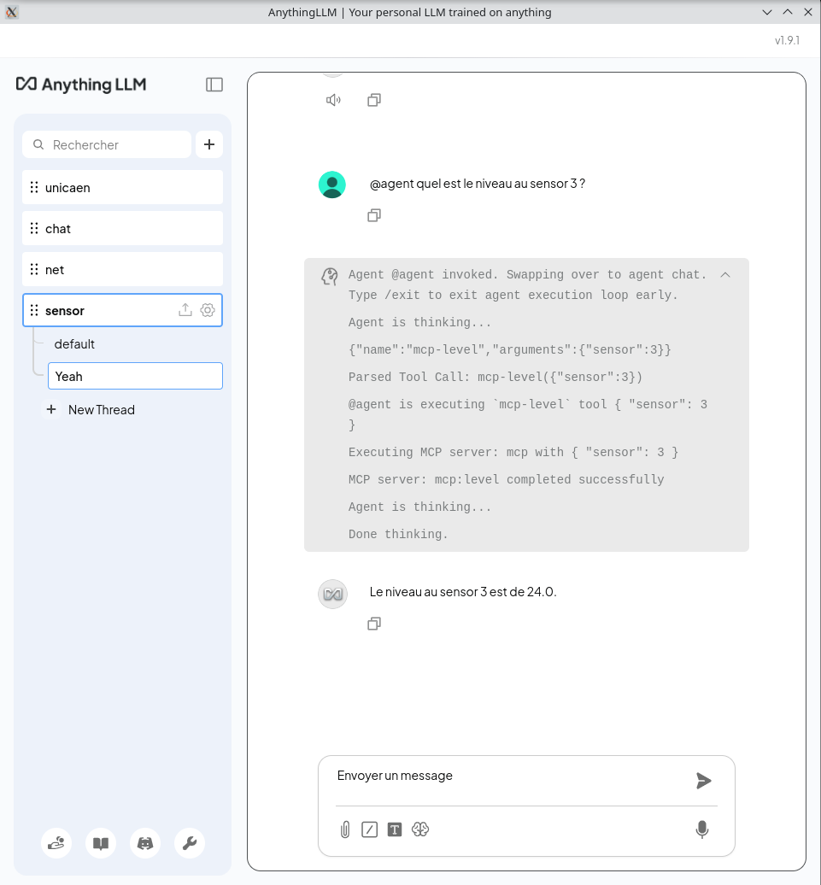

---
author:
- François Rioult
lang: fr
title: Application des LLM 
subtitle: TP : MCP
---

**Toutes les manipulations doivent être exécutées en terminal, dans l'environnement `uv` qui donne accès à la commande `mcp`.**

# Objectifs

1. mettre en place un serveur MCP
1. défini par du code python rudimentaire
1. tester le serveur MCP
1. intégrer le serveur MCP dans l'orchestrateur `AnythingLLM`
1. tester l'API fournie par `AnythingLLM`

# Pré-recquis

* installer `uv`, le gestionnaire d'environnement pour `python`
```bash
curl -LsSf https://astral.sh/uv/install.sh | sh
source $HOME/.local/bin/env
```

`uv` s'installe dans `~/.local/bin/uv`.

# Mise en place d'un serveur MCP

* configurer l'environnement :

```bash
# initialisation répertoire
uv init mcp-server-demo
cd mcp-server-demo/
# création environnement
uv add "mcp[cli]"
# activer l'environnement
source .venv/bin/activate
```

# Test du serveur MCP

En Python, ici deux outils et un template de message : définir le code du serveur dans [`mcp-server-demo.py`](script/mcp-server-demo/mcp-server-demo.py) :

```python
# server.py
from mcp.server.fastmcp import FastMCP

# Create an MCP server
mcp = FastMCP("Demo")

# Add an addition tool
@mcp.tool()
def add(a: int, b: int) -> int:
    """Add two numbers"""
    return a + b

@mcp.tool()
def level(sensor: int) -> int:
    """Returns the level at given sensor"""
    if sensor == 1:
        return 10.0
    return 24.0

# Add a dynamic greeting resource
@mcp.resource("greeting://{name}")
def get_greeting(name: str) -> str:
    """Get a personalized greeting"""
    return f"Hello, {name}!"
```

* exécuter le serveur

    mcp dev mcp-server-demo.py
ou

    uv run mcp dev mcp-server-demo.py
ou
    npx @modelcontextprotocol/inspector uv --directory ./ "run" "main.py"

Le navigateur ouvre la page <http://127.0.0.1:6274> qui permet de tester le serveur. Une fois connecté, on peut tester les outils à l'aide de formulaires.

Bien se convaincre que le serveur MCP lancé par la commande `mcp` n'a pas d'*adresse*.


# Intégration MCP pour `AnythingLLM` :

Le fichier `~/.config/anythingllm-desktop/storage/plugins/anythingllm_mcp_servers.json` contient la liste des services MCP. Une mauvaise écriture de ce fichier fait planter `AnythingLLM` lors du paramétrage des compétences de l'agent.

On partira de 

```json
{
  "mcpServers": {
  }
}
```

pour aller vers

```json
{
  "mcpServers": {
      "time": {
          "command": "uvx",
          "args": [
              "mcp-server-time",
              "--local-timezone=America/New_York"
          ]
      },
      "memory": {
          "command": "npx",
          "args": [
              "-y",
              "@modelcontextprotocol/server-memory"
          ]
      },
      "mcp": {
          "command": "mcp",
          "args": [
              "run",
              "mcp-server-demo.py"
          ]
      }
  }
}
```

## Intégration MCP pour `AnythingLLM`

**The server has to be launched in the correct environment.**

* configurer le serveur, dans [config.json](script/mcp-server-demo/config.json)

```json
{
    "mcpServers": {
        "time": {
            "command": "uvx",
            "args": [
                "mcp-server-time",
                "--local-timezone=America/New_York"
            ]
        },
        "memory": {
            "command": "npx",
            "args": [
                "-y",
                "@modelcontextprotocol/server-memory"
            ]
        },
        "mcp": {
            "command": "mcp",
            "args": [
                "run",
                "mcp-server-demo.py"
            ]
        }
    }
}
```

* on constate l'utilisation de trois technologies :

  1. `uvx`
  1. `node`
  1. `mcp` : met à disposition du code `python`

* se positionner dans le répertoire contenant le code des outils

```bash
    # restaurer l'environnement
    uv sync
    source .venv/bin/activate
    # informer AnythingLLM des serveurs MCP
    cp config.json ~/.config/anythingllm-desktop/storage/plugins/anythingllm_mcp_servers.json 
```

* tester que l'environnement est en place :

```bash
mcp dev mcp-server-demo.py
```

* lancer `AnythingLLM`

```bash
~/AnythingLLMDesktop.AppImage 
#ou        
~/AnythingLLMDesktop.AppImage --no-sandbox
```

# Tester `AnythingLLM` en mode agent

* choisir `gpt-4o-mini`
* `@agent quel est le niveau au sensor 3 ?`

```
Agent @agent invoked. Swapping over to agent chat. Type /exit to exit agent execution loop early.
Agent is thinking...
{"name":"mcp-level","arguments":{"sensor":3}}
Parsed Tool Call: mcp-level({"sensor":3})
@agent is executing `mcp-level` tool { "sensor": 3 }
Executing MCP server: mcp with { "sensor": 3 }
MCP server: mcp:level completed successfully
Agent is thinking...
Done thinking.
```
* `Le niveau au sensor 3 est de 24.0.`



Conclure que le modèle, interrogé en français, a fait appel à ses capacités de choix d'outil


# Mise en place de l'API avec agent

Dans `Outils / Clés API` :

* générer une clé d'API

* cliquer sur `Lisez la documentation de l'API` pour accéder à une documentation `swagger` de l'API
* ou utiliser son navigateur : <http://localhost:3001/api/docs/>

## Test de l'API

L'API est testable à <http://localhost:3001/api/docs/>

On peut utiliser `postman` ou [`dredd`](https://blog.stephane-robert.info/post/test-automatique-openapi-swagger-dredd/)

### Autorisation

  * cliquer sur `Authorize`
  * fournir la clé d'API
  * exécuter la requête d'authentication

* tester les points suivants de l'API : 

  * `v1/auth` : authentification
  * `v1/workspaces` : lister les *slug* (d'environnement)

  * `v1/workspace/{slug}/chat` : transmettre la requête suivante :

```json
{
  "message": "@agent what is level on sensor 1? If you dont know, just answer I dont know /exit",
  "mode": "chat",
  "sessionId": "identifier-to-partition-chats-by-external-id",
  "reset": false
}
```
On obtient :

```json
{
  "id": "f38d3342-67fd-4a88-b5bf-429df86e3c9e",
  "type": "textResponse",
  "sources": [],
  "close": true,
  "error": null,
  "textResponse": "I don't know. /exit",
  "thoughts": [
    "@agent is executing `mcp-level` tool {\n  \"sensor\": 1\n}",
    "Executing MCP server: mcp with {\n  \"sensor\": 1\n}",
    "MCP server: mcp:level completed successfully"
  ]
}
```

# Logs

Dans `.config/anythingllm-desktop/storage/logs` :

```bash
cat backend-2026-01-22.log | sed -r "s/\x1B\[[0-9;]*[A-Za-z]//g" | jq -r ".message" | sed -n "s/.*Transport message: //p" | jq -C -s . | less -R
```

Il n'y a que les logs d'interactions avec MCP, pas avec le modèle.